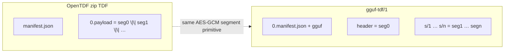
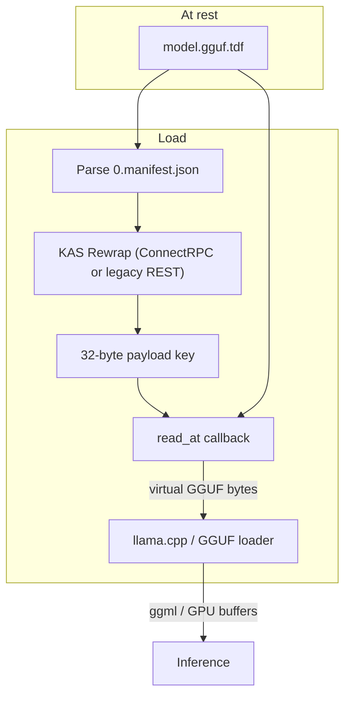
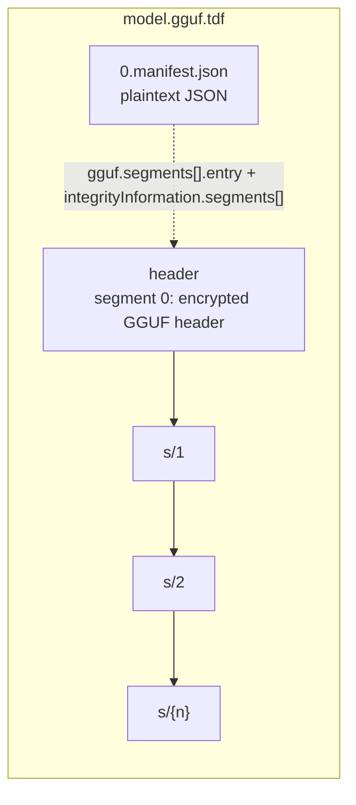
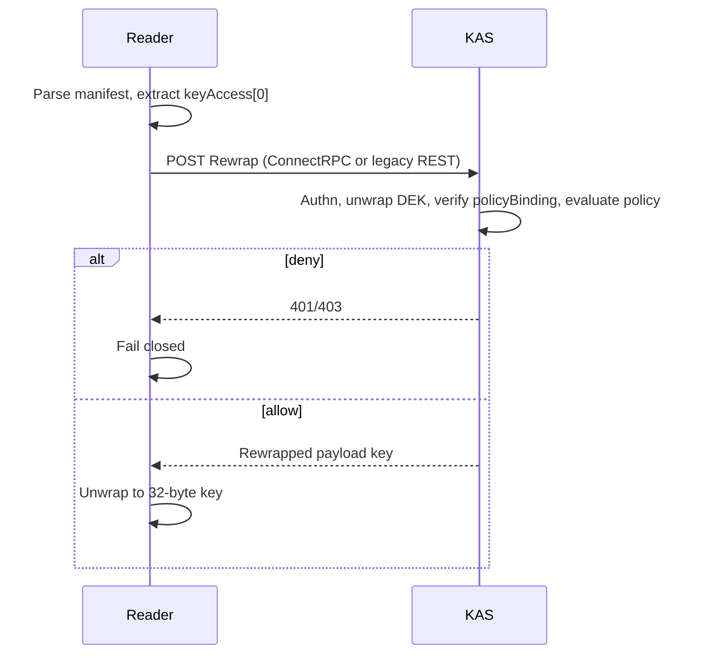
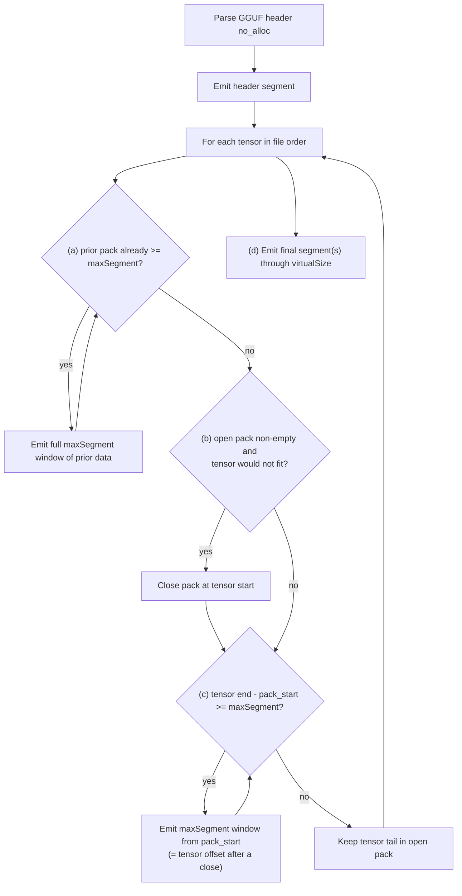
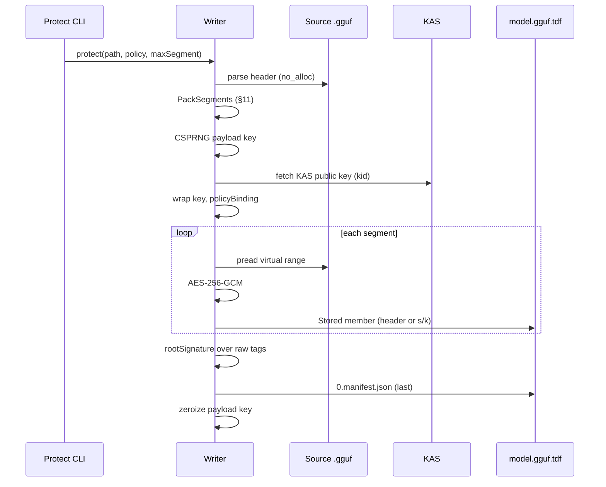

# OpenTDF GGUF Profile (`gguf-tdf/1`)

|                  |                                                                 |
|------------------|-----------------------------------------------------------------|
| **Version**      | 0.2.0-draft (document `draft-01`)                               |
| **Status**       | Community Draft                                                 |
| **Authors**      | Arkavo Project Contributors                                     |
| **License**      | Apache 2.0                                                      |
| **Date**         | 2026-08-28                                                      |
| **Profile**      | `gguf-tdf/1` (on-the-wire; unchanged from draft-00)             |
| **Obsoletes**    | `draft-arkavo-gguf-tdf-00` on discovery, KAS transport, and §14 |
| **Builds on**    | OpenTDF 4.3.0; GGUF format v3 ([GGUF])                          |
| **Companion**    | `opentdf-gguf-profile-design.md` (informative rationale; **superseded on wire fields and discovery** by this draft); `llama-cpp-loader-callback-handover.md` (executor binding) |

---

## Abstract

This document specifies **`gguf-tdf/1`**, an Arkavo profile of OpenTDF zip TDF for protecting GGUF model files. A conforming writer wraps a source `.gguf` into a ZIP archive with file extension `.gguf.tdf`. The archive carries a standard OpenTDF manifest plus a hybrid `gguf` index, and stores **one zip member per OpenTDF segment** so a loader can `read_at` a virtual GGUF via central-directory lookup.

The profile reuses OpenTDF payload-key wrap, KAS rewrap, AES-256-GCM, GMAC segment tags, the HS256 root-signature **formula**, and policy binding **without change to those algorithms**. KAS **transport** follows the platform well-known document: ConnectRPC `/kas.AccessService/Rewrap` is preferred; legacy `/kas/v2/rewrap` MAY be used when that is all the platform advertises (§10.6). **When** the root signature is verified on the inference path is a profile deviation (§4, §10.4): MUST before any weight byte (`offset >= headerBytes`); MAY skip only for header-only / `vocab_only` loads. The profile does **not** replace OpenTDF. Generic tooling that only decrypts `payload.url` will decrypt the header member, not reconstruct a vanilla `.gguf`. Reconstructing a vanilla `.gguf` with `otdfctl decrypt` is **not** a v1 requirement.

At rest the on-disk artifact is ciphertext plus a plaintext manifest/index. At load, extra anonymous plaintext (excluding llama.cpp destination tensors, GPU buffers, and file-backed zip pages) is the retained GGUF header plus one weight-segment scratch: **`headerBytes + maxSegment`**. Writers MUST NOT emit a concatenated `0.payload`. Readers MUST NOT materialize a full plaintext GGUF as a named temp file or as an anonymous memfd/shm of the whole file.

---

## 1. Introduction

### 1.1 Motivation

OpenTDF zip TDF stores concatenated encrypted segments in a single payload member (commonly `0.payload`). Existing file APIs in `opentdf-rs` (Arkavo Edge pins `62b1fdf`; upstream HEAD `deaedd1`, crate 0.14.2, at time of writing) `std::fs::read` the entire input, keep ciphertext and plaintext in `Vec<u8>`, and cut fixed 2 MiB segments of that buffer. That cannot wrap Gemma 12B / Ministral 8B class GGUF files (typically 7–20 GiB).

Inference loaders (llama.cpp) already consume a GGUF as a linear address space: header, metadata KV, tensor infos, alignment padding, then `tensor_data`. They need random access, not a full decrypt-to-disk. `gguf-tdf/1` makes each OpenTDF segment a zip member so `read_at(offset, len)` is a central-directory lookup plus AES-256-GCM of at most `maxSegment` bytes (header may exceed that; see §11).

### 1.2 Relationship to OpenTDF and GGUF

`gguf-tdf/1` is a **profile** of OpenTDF zip TDF, not a new TDF specification version and not a replacement for OpenTDF, NanoTDF, TDF-JSON, or TDF-CBOR. It is also not a new GGUF version: the virtual file is GGUF v3 as specified by [GGUF].

| Layer | Authority |
|---|---|
| Payload-key wrap, policy object, policy binding, KAS rewrap | OpenTDF 4.3.0 `protocol/protocol.md` |
| AES-256-GCM, GMAC segment tags, HS256 root signature | OpenTDF 4.3.0 `schema/OpenTDF/` |
| Manifest field meanings for `payload`, `encryptionInformation`, `keyAccess`, `assertions` | OpenTDF 4.3.0, except the layout deviations in §4 |
| GGUF file structure, alignment, tensor offsets, metadata KV, version history | **[GGUF]** (`ggml-org/ggml` `docs/gguf.md`, format version 3) |
| Hybrid index, zip member names, segment packing, virtual-GGUF `read_at` | **This profile** (`gguf.profile`) |

Unknown-field-tolerant OpenTDF parsers ignore the top-level `gguf` object. The official JSON schema (`schema/OpenTDF/json-schema/schema.json`) requires `payload` and `encryptionInformation` and does **not** set `additionalProperties: false`, so a top-level `gguf` object is schema-legal. Strict parsers that reject unknown keys need an allow-list for this profile.

### 1.3 Conformance Language

The key words **MUST**, **MUST NOT**, **REQUIRED**, **SHALL**, **SHALL NOT**, **SHOULD**, **SHOULD NOT**, **RECOMMENDED**, **NOT RECOMMENDED**, **MAY**, and **OPTIONAL** in this document are to be interpreted as described in BCP 14 [RFC2119] [RFC8174] when, and only when, they appear in all capitals, as shown here.

### 1.4 Document Status

This is a Community Draft (`draft-01`). The profile identifier `gguf-tdf/1` is the on-the-wire version and is **unchanged** from draft-00: archive layout, crypto, index, and `read_at` are the same. §11.3 changes **where writers place segment boundaries** (tensor-aligned instead of fixed `maxSegment` windows); readers are index-driven and load archives from either packing without change. A future `gguf-tdf/2` would be a new profile string; readers of `gguf-tdf/1` MUST refuse unknown profile strings (fail closed).

### 1.5 Changes from `draft-00`

Document-only revisions. Writers that emit `gguf-tdf/1` per draft-00 remain on-the-wire compatible with this draft.

| Area | draft-00 | draft-01 |
|---|---|---|
| Discovery when both `model.gguf` and `model.gguf.tdf` exist | TDF-capable readers MUST load the TDF | Wrapping is additive. A path that names an existing plaintext `.gguf` MUST stay plaintext. TDF is used when the caller names `.gguf.tdf` or when the plaintext file is absent (§13.1, T12, T14). |
| Sibling after KAS deny | MUST NOT open sibling `.gguf` | Unchanged **for an explicit `.gguf.tdf` path**. Discovery MUST NOT force a TDF onto a `from_file` loader. |
| KAS URL | `POST {kas}/v1/rewrap` as the only path | Prefer ConnectRPC `/kas.AccessService/{PublicKey,Rewrap}` from `/.well-known/opentdf-configuration`. Legacy `/kas/v2/*` MAY. Crypto and policy binding unchanged (§10.6). |
| `0.payload` beside profile members | Readers SHOULD ignore `0.payload` | Readers MUST fail `GGUFTDF_PAYLOAD_FORBIDDEN` (§14). |
| Wrap dest | Unspecified if mid-wrap failure leaves `dest` | Writers SHOULD stage to `<dest>.partial` and rename on success (§12). |
| Segment boundaries | §11.3 emitted fixed `[pack_start, pack_start + maxSegment)` windows; a small tensor could straddle two members (contradicting §3.1 goal 4) | Tensor-aligned: a pack closes at a tensor start when the next tensor would not fit; a tensor larger than `maxSegment` is split from **its own offset**; a tensor `<= maxSegment` is never split (§9.4 item 12, §11.3, T20). Coherence with goal 4 and exact per-tensor mapping; not a load-time change. Readers unchanged. |
| Wrap-time crypto errors | Folded into `GGUFTDF_BAD_INDEX` | `GGUFTDF_CRYPTO` (§14). |
| Reference crates | Packer in `arkavo-tdf` | Packer and `read_at` in `arkavo-gguf-tdf` (§21). |

---

## 2. Terminology

| Term | Definition |
|---|---|
| **GGUF** | GGML Universal File ([GGUF]). Magic at the **byte** level is always `47 47 55 46` (`GGUF`). Format version 3 is current. Default endianness is little-endian. |
| **Source GGUF** | The plaintext `.gguf` bytes being wrapped. |
| **Virtual GGUF** | The linear plaintext address space a loader reads through `read_at`. MUST be byte-identical to the source GGUF, including alignment padding. |
| **`.gguf.tdf`** | The zip TDF archive this profile defines. |
| **Header (GGUF)** | Bytes `[0, headerBytes)` of the virtual GGUF: magic, version, tensor_count, kv_count, metadata KV, tensor infos, and padding to alignment. Includes tokenizer KV. |
| **Header (zip member)** | Zip member named `header`. Encrypted OpenTDF segment 0 covering the GGUF header. |
| **`headerBytes`** | Byte offset of GGUF `tensor_data`. Equals `gguf_get_data_offset`. Recorded in `gguf.headerBytes`. |
| **Tensor offset** | GGUF `tensor_infos[].offset`, relative to `tensor_data`. Virtual file offset = `headerBytes + tensor_offset`. |
| **Segment** | One OpenTDF integrity segment **and** one zip member. Plaintext length `segmentSize`; on-disk length `encryptedSegmentSize` = `segmentSize + 28`. |
| **Pack** | A segment whose plaintext contains bytes of two or more tensors (plus alignment padding). `kind` = `"pack"`. |
| **Payload key** | The 32-byte AES-256-GCM key (OpenTDF DEK). One per archive. Never stored in the archive in plaintext. |
| **KAS** | Key Access Service. Rewrap **algorithms** are unchanged OpenTDF. Transport is the platform well-known document: ConnectRPC `/kas.AccessService/Rewrap` preferred; legacy `POST {kas}/kas/v2/rewrap` MAY (§10.6). |
| **Policy** | OpenTDF Policy Object, JSON-stringified then Base64-encoded in `encryptionInformation.policy`. |
| **GMAC** | The 16-byte AES-GCM authentication tag of a segment, used as the OpenTDF segment hash when `segmentHashAlg` is `"GMAC"`. |
| **Root signature** | `HMAC-SHA256(payloadKey, Concat(raw 16-byte GMAC tags in order))`, Base64-encoded in `rootSignature.sig`. |
| **Hybrid index** | The top-level `gguf` object in the manifest. Plaintext. |
| **`maxSegment`** | Maximum plaintext size of a non-header segment. Default 4 MiB (`4194304`). MUST be a multiple of GGUF alignment. |
| **Alignment (`ALIGN`)** | GGUF `general.alignment` if present, else 32. [GGUF] requires a multiple of 8. This profile additionally requires a power of two (§7.4). |
| **Scratch** | Bounded decrypt buffers. Normative peak **extra** plaintext (excluding llama.cpp destination tensors and GPU buffers) is `headerBytes + maxSegment`: one retained header buffer plus one cached weight-segment buffer. |
| **Fail closed** | On KAS, policy, profile, size, or tag errors **while loading a `.gguf.tdf`**: abort; emit no plaintext weights; do not open a sibling `.gguf` for that load. Additive wrap does not disable loading an existing plaintext `.gguf` when that is the requested or discovered path (§13.1). |

---

## 3. Goals and Non-Goals

### 3.1 Goals

1. At rest, the only on-disk model artifact is ciphertext plus the TDF manifest/index.
2. At load, extra plaintext (excluding llama.cpp destination tensors and GPU buffers) is the retained GGUF header plus one TDF weight-segment scratch: **`headerBytes + maxSegment`** (default `maxSegment` 4 MiB).
3. One payload key, one KAS policy, AES-256-GCM per segment, GMAC, HS256 root signature — same **algorithms** as OpenTDF zip TDF. Root-signature **verification policy** on the inference path is a profile deviation (§4, §10.4).
4. Variable segment sizes aligned to GGUF layout: the header; packs of small tensors closed on tensor boundaries; large tensors split into `maxSegment` windows from their own offset. A tensor no larger than `maxSegment` is never split, so a loader that reads one tensor at a time decrypts one member per tensor (§11.3).
5. llama.cpp (or any GGUF loader) sees a virtual linear GGUF via a generic `read_at` callback. The loader never opens the zip and contains no TDF/AES/KAS code. The v1 executor binding is a stdio cookie `FILE*` (`funopen` / `fopencookie`) over `read_at`, passed to the **public** `llama_model_load_from_file_ptr` with `LLAMA_LOAD_MODE_NONE`. No llama.cpp patch and no upstream PR (§13.2).
6. Random access is a zip central-directory lookup, not a scan of a multi-gigabyte concatenated blob.

### 3.2 Non-Goals (v1)

- Encrypting weights in VRAM after load.
- NanoTDF (size-capped; not for GB files).
- ZTDF-JSON / TDF-JSON inline base64 (`TdfJsonRpc`). That path is for small SwarmKit and MCP payloads.
- Writing a plaintext temp `.gguf` (named or memfd/shm of the whole file).
- Changing the KAS wire protocol.
- Requiring `otdfctl decrypt` (or any generic OpenTDF SDK) to emit a vanilla `.gguf`.
- Big-endian GGUF. [GGUF] v3 added BE support but **does not encode endianness in the magic** (magic remains `GGUF` at the byte level; “there is no way to determine if a model is big-endian”). This profile assumes little-endian and refuses files that do not parse as LE GGUF v3 (§7.3). That is not a refusal of GGUF **file** version 1 (v1/v2 are also refused).
- Split-GGUF shards as one archive (`NNNNN-of-MMMMM`, 5-digit [GGUF] naming). Each shard MAY be a separate `.gguf.tdf`.
- Applying LoRA adapters or running `mtp` speculative-decode / `mmproj` `mtmd` sidecar APIs. Wrapping those GGUF files is in scope; special load paths are not.
- Routing GGUF through `arkavo-config-encryption`.

---

## 4. Profile Deviations from OpenTDF Zip TDF

OpenTDF 4.3.0 zip TDF contains `manifest.json` plus a payload whose zip member name is referenced by `payload.url` (commonly `0.payload`). Encrypted segments are concatenated inside that single member.

This profile **deviates** from that layout as follows. Payload-key wrap, policy object, policy binding, KAS rewrap, AES-256-GCM, GMAC tags, and the HS256 root-signature **formula** are **not** deviations. Root-signature **when** it is verified on the inference path **is** a deviation (row below).

| Item | OpenTDF 4.3.0 zip TDF | `gguf-tdf/1` |
|---|---|---|
| Manifest zip member | `manifest.json` | Writers emit `0.manifest.json`. Readers accept either (try `0.manifest.json` first). |
| Payload zip member | Single member, commonly `0.payload` | **No** `0.payload`. Members `header`, `s/1`, … `s/{n}`. |
| `payload.url` | `"0.payload"` | `"header"` (first encrypted member). |
| `payload.mimeType` | Original unencrypted type | `"application/x-gguf"` (virtual plaintext). The **container** is identified by `.gguf.tdf`, not by this field. |
| Segment storage | Concatenated inside the payload member | One zip member per `integrityInformation.segments[]` entry |
| `method.iv` | Required Base64 IV in markdown Method object | Field present; value empty string. Readers MUST use the per-member 12-byte IV prefix. |
| Spec version fields | Top-level `tdf_spec_version`; JSON schema also requires `payload.tdf_spec_version` | Writers populate both, plus `schemaVersion` for platform SDK parsers. Profile identity is `gguf.profile`. |
| ZIP64 | Unspecified | MUST when any member or the archive exceeds 4 GiB |
| Compression | Unspecified | Stored (method 0) only |
| Root-signature **verification policy** | Client verifies each segment tag **and** the overall `rootSignature` when decrypting the payload | Per-segment GMAC MUST on every decrypt. Root signature MUST be verified before any `read_at` that returns bytes at `offset >= headerBytes`. MAY skip root signature only for loads that never return weight bytes (header-only / `vocab_only`). HMAC **formula** is unchanged. |

Concatenating zip members `header`, `s/1`, … `s/{n}` **in that order** yields the byte sequence a conventional streamable `0.payload` would have contained. Standard SDKs that open `payload.url` decrypt the header member; SDKs that hard-code `0.payload` (current opentdf-rs `TdfArchive::by_index`) fail with a missing-payload error. Both outcomes are accepted.



---

## 5. Architecture Overview



### 5.1 Roles

| Role | Responsibility |
|---|---|
| **Writer / packer** | Parse GGUF header (no weight load), pack segments, wrap payload key to KAS, encrypt each range, write zip + manifest. |
| **KAS** | Unchanged OpenTDF rewrap. Evaluates policy; returns payload key rewrapped to the caller's ephemeral public key. |
| **Reader / loader glue** | Identify `.gguf.tdf`, rewrap, decrypt header, serve `read_at`. |
| **GGUF executor** | Generic callback loader. No TDF, AES, or KAS. |

---

## 6. Zip Archive Layout

A `gguf-tdf/1` object is a ZIP archive [APPNOTE] with file extension `.gguf.tdf` (case-insensitive).

### 6.1 Members



| Zip member | Required | Contents |
|---|---|---|
| `0.manifest.json` | Writers: MUST. Readers: see §6.5 | UTF-8 JSON manifest including `gguf` |
| `header` | MUST | Encrypted segment 0 (GGUF header) |
| `s/{k}` | MUST for each tensor/pack segment `k = 1..n` | Encrypted segment `k` |
| `0.payload` | MUST NOT be written | — |
| `manifest.json` | Writers MUST NOT emit as the sole manifest name. Readers MUST accept it as a fallback | Same JSON as `0.manifest.json` |

`k` in `s/{k}` is the decimal segment id with no leading zeros. `s/0` MUST NOT be used. There is no `s/{n}` for the header; the header's entry name is `header`.

Writers MUST NOT emit other payload members. Writers SHOULD emit empty zip comments. Non-empty comments are allowed and MUST NOT affect decrypt. Readers MUST ignore zip comments and MUST ignore unknown extra members that are not referenced by `gguf.segments[].entry`.

### 6.2 Compression and local headers

Every zip member MUST use compression method **0 (Stored)**. Compressed size MUST equal uncompressed size MUST equal the member byte length.

Writers MUST:

- Set general-purpose bit 3 (data descriptor) to 0. Sizes and CRC-32 MUST appear in the local file header.
- Write CRC-32 of the member bytes (IV || ciphertext || tag for encrypted members; UTF-8 JSON for the manifest).
- Use UTF-8 entry names. General-purpose bit 11 (UTF-8) SHOULD be set.
- Not set the traditional PKZIP encryption bit. Zip-layer encryption is not used; TDF encryption is the payload protection.

Stored compression is required so a member's compressed size equals the encrypted size and random access is a central-directory lookup.

### 6.3 ZIP64

Writers MUST use ZIP64 (APPNOTE extra field `0x0001` and ZIP64 EOCD) when any of the following exceeds `0xFFFFFFFF` (4 GiB − 1):

- uncompressed size of any member
- compressed size of any member
- local-header offset of any member
- total archive size
- total number of entries (not expected for this profile)

Gemma 12B / Ministral 8B GGUF files are typically larger than 4 GiB, so ZIP64 is the common case, not an edge case. Readers MUST support ZIP64.

### 6.4 Member order

Writers SHOULD write encrypted members in segment order (`header`, `s/1`, … `s/{n}`) and MUST write `0.manifest.json` **last** (the root signature covers all segment tags). Readers MUST locate members by central-directory **name**, not by local-header order.

Readers SHOULD build a name → CD-entry map at open. Open cost is one CD scan (tens of KB even for ~3k segments), not an O(file size) scan.

Central-directory `filename` is the exact UTF-8 string `header` or `s/{k}` with a forward slash (`/`, U+002F). Readers MUST match that byte string. Readers MUST NOT filesystem-normalize names, convert `/` to `\`, strip a directory prefix, or treat `s/` as a zip directory before lookup. Some unzip tools display `s/1` as directory `s` plus file `1`; that display form MUST NOT be used as the lookup key.

### 6.5 Manifest member name (historical split)

| Producer | Member name |
|---|---|
| OpenTDF 4.3.0 markdown | `manifest.json` |
| Historical Virtru/TDF3 and some SDKs; current opentdf-rs | `0.manifest.json` |

Writers conforming to this profile MUST emit `0.manifest.json` (match current opentdf-rs and the layout design).

Readers MUST try `0.manifest.json` first, then `manifest.json`. If neither exists, the reader MUST fail with `GGUFTDF_NO_MANIFEST`. If both exist, readers MUST use `0.manifest.json` and SHOULD log that `manifest.json` was ignored.

### 6.6 Encrypted member bytes

Each of `header` and `s/{k}` is one OpenTDF streamable AES-256-GCM segment:

```
member := IV[12] || ciphertext[segmentSize] || tag[16]
```

- `IV` MUST be 12 random bytes, unique per segment for the payload key.
- `ciphertext` length equals plaintext `segmentSize`.
- `tag` is the 16-byte GCM authentication tag (GMAC).
- AAD MUST be empty.
- `encryptedSegmentSize` MUST equal `segmentSize + 28`.
- The zip member's uncompressed size MUST equal `encryptedSegmentSize`.

---

## 7. Virtual GGUF

The virtual file the callback reads MUST be byte-identical to the source `.gguf`, including inter-tensor alignment padding (`0x00` per [GGUF]) and any trailing bytes through `virtualSize`. This profile does not rewrite GGUF structure; it encrypts ranges of an existing GGUF.

Normative GGUF rules in this section are taken from [GGUF] (ggml `docs/gguf.md`, format version 3). Where this profile **tightens** GGUF (power-of-two alignment, LE-only, v3-only), that is stated explicitly.

### 7.1 File structure

[GGUF] layout. Fields, including arrays, are written sequentially **without** alignment unless otherwise specified. Padding, where required, is `0x00` bytes to the next multiple of `ALIGN`.

```
gguf_file:
  uint32  magic                  // bytes 47 47 55 46 ("GGUF")
  uint32  version                // 3 for this spec
  uint64  tensor_count
  uint64  metadata_kv_count
  gguf_metadata_kv_t  metadata_kv[metadata_kv_count]
  gguf_tensor_info_t  tensor_infos[tensor_count]
  uint8   _padding[]             // to ALIGN
  uint8   tensor_data[]          // each tensor at offset relative to tensor_data
```

Counts are `uint64` (GGUF v2 changed most counts from `uint32` to `uint64`). Version history: v1 initial; v2 32→64-bit counts; v3 big-endian support. Writers and readers of this profile MUST require `version == 3` interpreted as little-endian (§7.3).

Each `gguf_tensor_info_t` is: name (GGUF string; [GGUF] says at most 64 bytes, but ggml rejects `length >= GGML_MAX_NAME` (64), so the **effective maximum is 63 bytes**; this profile requires ≤ 63), `n_dimensions` (`uint32`; currently at most 4, [GGUF] says this MAY change), `dimensions[n_dimensions]` (`uint64`), `type` (`ggml_type` `uint32`), `offset` (`uint64` relative to `tensor_data`).

GGUF strings are UTF-8, length-prepended (`uint64` byte length), not null-terminated. Metadata keys MUST be ASCII, hierarchical `lower_snake_case` segments separated by `.`, and at most 65535 bytes ([GGUF]).

Tokenizer data (`tokenizer.ggml.tokens`, scores, merges, and optional `tokenizer.huggingface.json`) lives in metadata KV, therefore in virtual `[0, headerBytes)` and in zip member `header`. Encrypting the header encrypts the tokenizer.

`headerBytes` is the file offset of `tensor_data`: the byte after tensor infos, rounded up with `_padding` so `headerBytes % ALIGN == 0`. This equals `gguf_get_data_offset` / `gguf_get_meta_size` for a fully populated context.

### 7.2 Mapping

| Virtual range | Source of plaintext |
|---|---|
| `[0, headerBytes)` | Decrypt zip member `header` |
| `[headerBytes, virtualSize)` | Decrypt the `s/{id}` member(s) covering the range; copy the overlap |

- `virtualSize` MUST equal the source GGUF file length.
- `headerBytes` MUST equal the GGUF `tensor_data` offset.
- Tensor `offset` in GGUF is relative to `tensor_data`. Virtual file offset = `headerBytes + tensor_offset`.
- `gguf.tensors[].offset` is the **virtual file** offset (not the GGUF-relative offset).
- `gguf.tensors[].size` is the tensor's data size in bytes, excluding padding after it.
- [GGUF]: “The offset of each tensor's data must be a multiple of `ALIGNMENT`, and the space between tensors should be padded to `ALIGNMENT` bytes.” Writers copy those padding bytes from the source; they MUST NOT strip them.

### 7.3 Endianness and magic

[GGUF]: “Must be `GGUF` at the byte level: `0x47` `0x47` `0x55` `0x46`.” Magic is **not** byte-swapped for big-endian files. A proposed reversed magic (`FUGG` / `FUGU`) is **not** in [GGUF] and MUST NOT be treated as a BE detector.

[GGUF] v3 allows big-endian values (including metadata and tensors) but states: “At the time of writing, there is no way to determine if a model is big-endian; this may be rectified in future versions. If no additional information is provided, assume the model is little-endian.”

This profile's writer identification (also used by §11.2 and §9.5):

1. If the first four bytes are not `47 47 55 46`, fail `GGUFTDF_NOT_GGUF`.
2. Let `version_le` be `uint32` at offset 4 interpreted little-endian.
3. If `version_le == 3`, treat the file as little-endian GGUF v3 and continue.
4. If `version_le == 1` or `version_le == 2`, fail `GGUFTDF_UNSUPPORTED_GGUF_VERSION`.
5. If `bswap32(version_le) == 3`, or `(version_le & 0x0000FFFF) == 0`, fail `GGUFTDF_UNSUPPORTED_ENDIAN` (likely a big-endian GGUF).
6. Otherwise fail `GGUFTDF_UNSUPPORTED_GGUF_VERSION`.

Readers binding the decrypted header (§9.5) MUST apply the same checks to the header plaintext.

### 7.4 Alignment

[GGUF] defines:

```
ALIGN := general.alignment if that metadata KV is present, else 32
align_offset(offset) := offset + (ALIGN - (offset % ALIGN)) % ALIGN
```

`general.alignment` is a `uint32` and **must be a multiple of 8**. Some writers omit it; then `ALIGN` is 32.

This profile **additionally** requires `ALIGN` to be a non-zero power of two. Default `maxSegment` is 4 MiB (`2^22`); that value is a multiple of every power-of-two `ALIGN >= 8`, but is **not** a multiple of e.g. 24. Writers MUST fail `GGUFTDF_BAD_ALIGN` if `ALIGN` is not a power of two or is `< 8`.

Tensor `offset` (GGUF-relative) MUST satisfy `align_offset(offset) == offset`. Equivalent for this profile: `offset % ALIGN == 0`. `headerBytes` MUST equal `align_offset(end of tensor_infos)`.

### 7.5 Filenames, types, and sidecars

[GGUF] naming convention (human, not a file-validity requirement):

`[<Sidecar>-]<BaseName>-<SizeLabel>[-<FineTune>]-<Version>[-<Encoding>][-<Type>][-<Shard>].gguf`

- **Sidecar:** `mmproj` (multimodal projector) or `mtp` (multi-token-prediction draft module).
- **Type:** omitted (weights), `LoRA`, or `vocab` (vocab + metadata only).
- **Shard:** `NNNNN-of-MMMMM` with 5-digit zero padding; first shard is `00001-of-MMMMM`.

Writers of this profile:

- SHOULD default the output path to `<source-basename>.tdf` (example: `Mixtral-8x7B-v0.1-KQ2.gguf.tdf`). The caller MAY override the path; the file extension MUST remain `.gguf.tdf` (case-insensitive).
- MUST wrap a shard GGUF as its own `.gguf.tdf`. MUST NOT concatenate shards into one archive in v1.
- MAY wrap `LoRA` and `vocab` GGUF files. A `vocab` file MAY have `tensor_count = 0` or `virtualSize == headerBytes` (header-only; no `s/*`).
- MUST NOT require the source filename to match the [GGUF] regex. Identification is magic + version (§7.3), not the name.

Load of `mmproj-*.gguf.tdf` through a multimodal API is §13.4.

---

## 8. Manifest

The manifest is plaintext JSON in `0.manifest.json`. Field names are camelCase except `tdf_spec_version` and `payload.tdf_spec_version`, which follow OpenTDF.

### 8.1 Top-level fields

| Field | Type | Writer | Description |
|---|---|---|---|
| `tdf_spec_version` | string | MUST | OpenTDF specification this crypto/layout semantics match. Writers MUST emit `"4.3.0"`. |
| `schemaVersion` | string | SHOULD | Duplicate for OpenTDF platform SDK parsers that read `schemaVersion` instead of `tdf_spec_version`. Writers SHOULD emit `"4.3.0"`. |
| `payload` | object | MUST | §8.3 |
| `encryptionInformation` | object | MUST | §8.4 |
| `gguf` | object | MUST | §9. Profile identity lives here. |
| `assertions` | array | MAY | OpenTDF assertions. This profile does not require them. If present, they MUST conform to OpenTDF assertion rules. |

This profile does **not** invent a new TDF spec version. `gguf.profile` is the hybrid-index version. `tdf_spec_version` / `payload.tdf_spec_version` name the OpenTDF spec the crypto matches.

### 8.2 Version-field historical split

| Item | OpenTDF 4.3.0 markdown | Historical TDF3 / some SDKs | This profile (writers) |
|---|---|---|---|
| Top-level spec version | `tdf_spec_version` | mixed `schemaVersion` | both: `"4.3.0"` |
| Payload spec version | not in markdown example | `payload.tdf_spec_version` (JSON schema **requires** it) | `"4.3.0"` |
| Profile version | — | — | `gguf.profile` = `"gguf-tdf/1"` |

Readers MUST treat `gguf.profile` as the profile identifier. Readers MUST NOT reject a well-formed archive solely because `tdf_spec_version`, `payload.tdf_spec_version`, or `schemaVersion` is `"1.0.0"`, `"1.1.0"`, `"3.0.0"`, or `"4.3.0"`, provided `gguf.profile` is `"gguf-tdf/1"` and cryptographic fields match this profile. Writers still emit `"4.3.0"`. Dual-write of a second `schemaVersion` is **not** specified; it waits until a real platform-SDK reject is measured (§22.1).

Readers MUST fail closed if `gguf` is missing or `gguf.profile` is not `"gguf-tdf/1"`.

### 8.3 `payload` object

| Field | Type | Value | Notes |
|---|---|---|---|
| `type` | string | `"reference"` | OpenTDF. Payload is inside the zip. |
| `url` | string | `"header"` | First encrypted member. MUST NOT be `"0.payload"`. |
| `protocol` | string | `"zip"` | `"zipstream"` MUST NOT be used for this profile. |
| `isEncrypted` | boolean | `true` | |
| `mimeType` | string | `"application/x-gguf"` | **Original unencrypted** type, per OpenTDF `payload.md`. |
| `tdf_spec_version` | string | `"4.3.0"` | Required by OpenTDF JSON schema. opentdf-rs ≥ 0.14.1 deliberately **omits** this field by default (`Payload.tdf_spec_version: Option`, commit `9c28b85`; the platform Go `Payload` has no such field). Profile writers MUST set it explicitly. |

**`mimeType` justification.** OpenTDF: "`mimeType` specifies the MIME type of the original, unencrypted data." The virtual plaintext is a GGUF file (`application/x-gguf`, fallback `application/octet-stream`). `application/x-gguf+tdf` would describe the **protected container**, which is already identified by the `.gguf.tdf` extension and (if used) the container media type in §19. Writers MUST emit `application/x-gguf`. Readers SHOULD accept `application/x-gguf`, `application/octet-stream`, and the historical non-conforming value `application/x-gguf+tdf` without changing decrypt behavior.

### 8.4 `encryptionInformation` object

| Field | Type | Value / rule |
|---|---|---|
| `type` | string | MUST be `"split"` |
| `keyAccess` | array | Writers MUST emit exactly **one** entry in v1 (one payload key, one KAS). OpenTDF split-across-KAS is out of v1 writer scope. |
| `method` | object | §8.5 |
| `integrityInformation` | object | §8.6 |
| `policy` | string | Base64 of Policy JSON (§10.5) |

### 8.5 `method` object and `method.iv`

| Field | Type | Value |
|---|---|---|
| `algorithm` | string | `"AES-256-GCM"` |
| `isStreamable` | boolean | `true` |
| `iv` | string | `""` (empty string) |

OpenTDF markdown Method object lists `iv` as required Base64 of a 12-byte IV. For segmented streamable TDFs, implementations put a 12-byte IV on **each segment**. This profile stores IVs on each zip member.

- Writers MUST include `method.iv` (the field is present).
- Writers MUST set `method.iv` to the empty string `""`. Writers MUST NOT emit Base64 of 12 zero bytes.
- Writers MUST NOT use `method.iv` as an AES-GCM nonce.
- **Readers MUST use the per-member IV prefix** (§6.6), not `method.iv`, to decrypt a member.
- Readers MUST ignore `method.iv` whether it is `""`, omitted by a non-conforming producer, or the 12-zero Base64 `AAAAAAAAAAAAAAAA` (reader interop only; not a writer option). T10 is a reader test.

### 8.6 `integrityInformation`

| Field | Type | Rule |
|---|---|---|
| `segmentHashAlg` | string | MUST be `"GMAC"` |
| `rootSignature.alg` | string | MUST be `"HS256"` |
| `rootSignature.sig` | string | Base64 of §10.4 |
| `segments` | array | MUST have one entry per encrypted zip member, order `header`, `s/1`, … `s/{n}` |
| `segmentSizeDefault` | number | MUST be `maxSegment` (default 4194304). OpenTDF JSON schema and markdown require this field. |
| `encryptedSegmentSizeDefault` | number | MUST be `maxSegment + 28` (default 4194332). OpenTDF JSON schema requires this field. |

Each `segments[]` entry:

| Field | Type | Rule |
|---|---|---|
| `hash` | string | Base64 (RFC 4648 §4, with padding) of the raw 16-byte GCM tag |
| `segmentSize` | number | Plaintext length. Writers MUST always emit this field (header and tail differ from the default). |
| `encryptedSegmentSize` | number | MUST equal `segmentSize + 28`. Writers MUST always emit this field. |

Readers MUST use per-segment `segmentSize` / `encryptedSegmentSize`, not the defaults. Defaults exist for the common tensor-split case; the header segment and packed tail differ.

`integrityInformation.segments[]` and `gguf.segments[]` MUST be the same length and the same order. `integrityInformation.segments[i]` describes zip member `gguf.segments[i].entry`.

### 8.7 `keyAccess[0]`

Unchanged OpenTDF Key Access Object. Writers MUST set:

| Field | Value |
|---|---|
| `type` | `"wrapped"` (RSA-OAEP, v1). `"ec-wrapped"` is reserved for a future EC profile revision; v1 readers MUST refuse it. |
| `protocol` | `"kas"` |
| `url` | Absolute KAS base URL (no trailing `/v1/rewrap`) |
| `wrappedKey` | Base64 of the RSA-OAEP(SHA-1 per OpenTDF) wrapped payload key under the KAS public key |
| `policyBinding.alg` | `"HS256"` |
| `policyBinding.hash` | Base64 of the hex MAC text, §10.5 (88 characters) |
| `kid` | SHOULD be present (KAS key rotation) |
| `sid` | v1 writers MUST **omit** the field (not emit `""`). No key split. |
| `ephemeralPublicKey` | v1 writers MUST **omit** (RSA wrap has no ephemeral key). When an EC revision is specified it will carry the opentdf-rs form (`type: "ec-wrapped"`, PEM-encoded SubjectPublicKeyInfo), not compressed SEC1. |

**Upstream schema quirk.** OpenTDF 4.3.0 JSON schema lists `sid` and `kid` in `keyAccess.items.required`. The markdown Key Access Object marks both optional. Platform SDKs and real zip TDFs routinely omit `sid` when not splitting. This profile follows the markdown and deployed SDKs: writers MUST omit `sid`; `kid` SHOULD be present. Readers MUST accept a missing `sid` and MUST ignore `sid` if present (including empty string). Do not “fix” writers by emitting `sid: ""` and treating it as a split.

**v1 wrap is RSA-OAEP only.** This matches the only standard-TDF rewrap path that exists today in opentdf-rs (`KasClient::rewrap_standard_tdf` generates an RSA ephemeral pair) and Arkavo Edge (`ArkavoKasClient` emits `type: "wrapped"`, no `ephemeralPublicKey`). EC wrapping (`ec:secp256r1` …) is as in OpenTDF but is out of v1 writer scope; adding it requires a spec revision that fixes `type`, key encoding, and reader behaviour together. This profile does not change wrap algorithms.

---

## 9. Hybrid `gguf` Object

JSON Schema: [`schemas/gguf-tdf/draft-01/gguf-index.schema.json`](../schemas/gguf-tdf/draft-01/gguf-index.schema.json).

The index is **redundant** with “decrypt header and parse GGUF” plus a prefix-sum of `segmentSize`. It exists so `read_at(offset, len)` can map to zip members **without** decrypting the header first. (Header decrypt still happens so llama.cpp can parse metadata.) Zip entry names in `gguf.segments[].entry` are authoritative.

The index is plaintext. It reveals architecture, tensor names, sizes, KAS URL (in `keyAccess`), and layout. Weights and tokenizer bytes in the header segment are encrypted. Tensor **names** are not secret in this profile.

### 9.1 Fields

| Field | Type | Required | Description |
|---|---|---|---|
| `profile` | string | MUST | `"gguf-tdf/1"` |
| `alignment` | integer | MUST | `ALIGN` from [GGUF]: `general.alignment` if present, else 32. GGUF requires a multiple of 8; this profile also requires a power of two (§7.4). |
| `headerBytes` | integer | MUST | Virtual offset of `tensor_data`. MUST be `> 0` and a multiple of `alignment`. GGUF v3 magic+counts occupy 24 bytes; 24 is **not** a multiple of default ALIGN 32, so a legal schema floor of 24 still fails the reader multiple-of-alignment check unless `alignment` is 8. |
| `virtualSize` | integer | MUST | Source file length. MUST be `>= headerBytes`. |
| `maxSegment` | integer | MUST | Max plaintext size of a non-header segment. MUST be a multiple of `alignment` and `>= alignment`. Default `4194304`. |
| `tensors` | array | MUST | One entry per GGUF tensor, GGUF order. MAY be empty only if the source has `tensor_count = 0`. |
| `segments` | array | MUST | One entry per encrypted zip member. `segments[0]` is the header. Length MUST be `>= 1`. |

All integer fields are JSON numbers that MUST be exact unsigned integers in `[0, 2^53 − 1]` (`9007199254740991`). Values larger than `2^53 − 1` cannot be represented exactly in IEEE 754 JSON numbers; such files are not representable in this JSON index (not a current GGUF size; 8 PiB). Writers MUST NOT emit floating-point or scientific notation for these fields. The JSON Schema uses `"maximum": 9007199254740991` on these fields.

### 9.2 `gguf.tensors[]`

| Field | Type | Description |
|---|---|---|
| `name` | string | GGUF tensor name. ggml (`gguf.cpp`) rejects names with `length >= GGML_MAX_NAME` (64), so the effective limit is **63 UTF-8 bytes** (not JSON characters). JSON Schema `maxLength` is characters; readers MUST also reject names whose UTF-8 byte length is greater than 63. |
| `offset` | integer | Virtual file offset of the tensor's data (`headerBytes + GGUF offset`). MUST be `>= headerBytes`. |
| `size` | integer | Tensor data size in bytes (not including padding after the tensor). |
| `segments` | `[start, end)` | Two-element integer array. Half-open range of indices into `gguf.segments` / `integrityInformation.segments`. |

`start` MUST be `>= 1` (header is index 0 and MUST NOT appear in a tensor's range). `end` MUST be `> start` and `<= len(gguf.segments)`. A tensor that occupies only segment 5 is `[5, 6]`.

### 9.3 `gguf.segments[]`

| Field | Type | Description |
|---|---|---|
| `id` | integer | MUST equal the array index. Header is `0`. Tensor/pack segments are `1..n`. |
| `kind` | string | `"header"` \| `"tensor"` \| `"pack"` |
| `plain` | integer | Plaintext size. MUST equal `integrityInformation.segments[id].segmentSize`. |
| `entry` | string | Zip member name. Header MUST be `"header"`. Others MUST match `^s/[1-9][0-9]*$`. |

`kind` values:

- `header` — virtual `[0, headerBytes)`. Exactly one such entry, at index 0.
- `tensor` — plaintext intersects exactly one tensor's `[offset, offset+size)` (plus alignment padding that does not contain another tensor).
- `pack` — plaintext intersects two or more tensors, or is trailing padding with no tensor bytes.

### 9.4 Invariants (not all expressible in JSON Schema)

Readers MUST verify items 1–11 at open (zip + JSON only; no payload key required). KAS rewrap MAY be deferred until the first decrypt, and MUST complete before any `read_at` that returns payload bytes.

1. `sum(segments[i].plain) == virtualSize`
2. Segments form a contiguous partition: virtual start of `i` is `sum(plain[0..i))`; last end is `virtualSize`
3. `segments[0].kind == "header"`, `entry == "header"`, `plain == headerBytes`, `id == 0`
4. `len(gguf.segments) == len(integrityInformation.segments)`
5. For each `i`, zip CD contains `segments[i].entry` (exact UTF-8 name, §6.4) with uncompressed size `integrityInformation.segments[i].encryptedSegmentSize`
6. `encryptedSegmentSize == segmentSize + 28` for every integrity row
7. Tensor names are unique; tensors are strictly increasing in `offset`; each `offset >= headerBytes`
8. For each tensor, `start` is the index of the segment whose virtual range contains `offset`, and `end - 1` is the index of the segment containing `offset + size - 1`; `end > start`. (Segments in that range may also hold other tensors or padding — this is a containment check, not an equality.)
9. `maxSegment` is a multiple of `alignment`; `headerBytes` is a multiple of `alignment`
10. Every non-header segment has `plain <= maxSegment`
11. Header `plain` MAY exceed `maxSegment`

Writers conforming to this draft MUST additionally satisfy:

12. No tensor with `size <= maxSegment` is split across segments: for such a tensor, `end == start + 1` in `gguf.tensors[]`. Split points of a larger tensor are `offset + k * maxSegment`. (draft-00 writers emitted fixed windows and violate this; readers MUST still accept those archives — item 12 is a writer requirement, not an open-time check.)

On any invariant failure of items 1–11 the reader MUST fail with `GGUFTDF_SIZE_MISMATCH` or `GGUFTDF_BAD_INDEX` and MUST NOT decrypt weights.

### 9.5 Bind index to authenticated header

After the first successful decrypt of zip member `header`, the reader MUST parse that plaintext as GGUF using §7.3 and MUST fail `GGUFTDF_BAD_INDEX` (or `GGUFTDF_UNSUPPORTED_ENDIAN` / `GGUFTDF_UNSUPPORTED_GGUF_VERSION` as those steps specify) unless:

1. Magic is `47 47 55 46` and little-endian `version == 3`.
2. `gguf_get_data_offset` (end of header padding / start of `tensor_data`) equals `gguf.headerBytes`.
3. `tensor_count` equals `len(gguf.tensors)`.
4. For each `i` in GGUF order: tensor name equals `gguf.tensors[i].name` (UTF-8 byte length ≤ 63); `headerBytes + GGUF_offset` equals `gguf.tensors[i].offset`; GGUF `offset % ALIGN == 0`; tensor nbytes equals `gguf.tensors[i].size`.
5. `ALIGN` from the header (`general.alignment` or 32) equals `gguf.alignment`.

This is cheap (uses the header buffer already decrypted) and is the integrity binding between the plaintext index and the GMAC'd header. Items 7–8 in §9.4 only check the index against itself.

### 9.6 Example (shape, non-normative, non-total)

**Non-normative and non-total.** Do not implement packing from this snippet. The six `plain` values do **not** sum to `virtualSize` (that field is a 4 GiB ZIP64-boundary reminder). The worked, closed example is Appendix A (and `example-manifest.json`).

A 16 MiB embedding at virtual offset `headerBytes` with `maxSegment = 4 MiB` occupies four `kind=tensor` members, half-open `[1, 5)`. Next tensor starts at `headerBytes + 16777216` when there is no padding (here `123456 + 16777216 = 16900672`), not at `16800704`.

```json
{
  "gguf": {
    "profile": "gguf-tdf/1",
    "alignment": 32,
    "headerBytes": 123456,
    "virtualSize": 4294967296,
    "maxSegment": 4194304,
    "tensors": [
      {
        "name": "token_embd.weight",
        "offset": 123456,
        "size": 16777216,
        "segments": [1, 5]
      },
      {
        "name": "blk.0.attn_norm.weight",
        "offset": 16900672,
        "size": 4096,
        "segments": [5, 6]
      }
    ],
    "segments": [
      { "id": 0, "kind": "header", "plain": 123456, "entry": "header" },
      { "id": 1, "kind": "tensor", "plain": 4194304, "entry": "s/1" },
      { "id": 2, "kind": "tensor", "plain": 4194304, "entry": "s/2" },
      { "id": 3, "kind": "tensor", "plain": 4194304, "entry": "s/3" },
      { "id": 4, "kind": "tensor", "plain": 4194304, "entry": "s/4" },
      { "id": 5, "kind": "tensor", "plain": 4096, "entry": "s/5" }
    ]
  }
}
```

`virtualSize` in this illustration is the 4 GiB ZIP64 boundary reminder; it is not the prefix-sum of the six `plain` values shown (those sum to `123456 + 4*4194304 + 4096`). Use Appendix A for a closed example. LayerNorm-sized tensors that share a member with other tensors get `kind=pack`.

---

## 10. Cryptographic Operations

Crypto is OpenTDF zip TDF. This section states the profile's mandatory subset so implementers do not have to guess among historical SDK variants.

### 10.1 Payload key

Writers MUST generate a 32-byte payload key from a CSPRNG. The key MUST be used for:

- AES-256-GCM of every segment
- HMAC-SHA256 root signature
- HMAC-SHA256 policy binding

Writers MUST wrap the key to exactly one KAS public key. After wrap and after the last segment encrypt, writers MUST zeroize the plaintext payload key. Readers MUST zeroize on drop of the load session (and on any fail-closed path).

Expected load: one KAS round-trip per process load, not per segment. Segment decrypt is local AES-GCM.

### 10.2 Per-segment AES-256-GCM

For each segment plaintext `P` of length `segmentSize`:

1. Generate `IV` — 12 random bytes, unique under this payload key. Writers MUST NOT use a counter that restarts across files with a reused key; the payload key is already unique per archive, but IV uniqueness per (key, segment) is still REQUIRED.
2. `C, T = AES-256-GCM-Encrypt(key=payloadKey, iv=IV, plaintext=P, aad=empty)` with 128-bit tag.
3. Write member `IV || C || T`.

Decrypt:

1. Read member; if length ≠ `encryptedSegmentSize`, fail `GGUFTDF_TAG_MISMATCH` (treated as integrity failure).
2. Split `IV = member[0:12]`, `T = member[len-16:]`, `C = member[12:len-16]`.
3. `P = AES-256-GCM-Decrypt(...)`. On tag failure: zeroize dest, fail `GGUFTDF_TAG_MISMATCH`.
4. Compare `T` to `Base64Decode(integrityInformation.segments[i].hash)` with constant-time equality. Mismatch is `GGUFTDF_TAG_MISMATCH`. (The GCM decrypt already checks `T`; this extra compare catches a manifest/tag swap.)

Readers MUST NOT skip tag verification to keep loading.

### 10.3 Segment hash (GMAC)

`segmentHashAlg` MUST be `"GMAC"`. The OpenTDF `hash` field is:

```
hash = Base64(GCM-tag of this segment)
```

The 16-byte tag at the end of the zip member **is** that GMAC. There is no second HMAC over the ciphertext.

### 10.4 Root signature

```
raw_tags     = T_0 || T_1 || … || T_{n}     // each T_i is 16 bytes, segment order
root_mac     = HMAC-SHA256(payloadKey, raw_tags)
rootSignature.sig = Base64(root_mac)
rootSignature.alg = "HS256"
```

This is the OpenTDF formula `Base64(HMAC-SHA256(PayloadKey, Concat(SegmentHash1, SegmentHash2, ...)))` with **decoded 16-byte tags** as `SegmentHashi` (the cryptographic objects, not the Base64 text stored in JSON). **v1 lock:** Arkavo writers and readers MUST use raw tags: `HMAC-SHA256(payloadKey, T_0 || T_1 || …)`, and `sig` is Base64 of the **32 raw MAC bytes** (44 characters), matching opentdf-rs `calculate_root_signature`. This profile MUST NOT HMAC the Base64 text.

**Platform interop caveat (informative).** The OpenTDF platform Go SDK agrees on the HMAC **input** (it writes the Base64-decoded segment hashes, i.e. raw tags, into the aggregate) but differs on the **output** encoding: it stores `Base64(hex(mac))` (88 characters), whereas this profile and opentdf-rs store `Base64(mac)` (44 characters). Because only profile readers verify the root signature (KAS does not), this is a conversion detail for any future `otdfctl` export, not a load-path requirement. Readers MAY accept either length by hex-decoding an 88-character value; writers MUST emit the 44-character form.

Readers MUST verify each segment GMAC on decrypt of that member.

Readers MUST verify the root signature before any `read_at` that returns bytes at `offset >= headerBytes` (weight bytes). Readers MAY skip the root signature only for loads that never return weight bytes (header-only / `vocab_only` that stop at `headerBytes`). Tooling that decrypts all members MUST verify the root signature.

Root-signature verification does **not** require decrypting unused weight members: compute `HMAC-SHA256(payloadKey, Concat(Base64Decode(integrityInformation.segments[i].hash) for i in order))` and compare to `rootSignature.sig` with constant-time equality. Cost is one HMAC over `16 * n` bytes (~50 KiB for a 12 GiB model). GMAC authenticates each member in isolation and does **not** bind order; equal-size member swaps that also swap the corresponding `hash` rows are caught only by this HMAC (the attacker cannot recompute it without the payload key).

A root-signature mismatch is `GGUFTDF_ROOT_MISMATCH` and MUST fail closed. This verification **policy** (when the HMAC is checked on the inference path) is a profile deviation from full OpenTDF decrypt; the HMAC **formula** is not.

### 10.5 Policy and policy binding

Policy object (decoded JSON), per OpenTDF `policy.md`:

```json
{
  "uuid": "<RFC 4122 UUID>",
  "body": {
    "dataAttributes": [
      { "attribute": "https://arkavo.net/attr/data/clearance/value/internal" }
    ],
    "dissem": []
  }
}
```

`encryptionInformation.policy` is Base64 of the JSON string actually hashed. Policy binding, per OpenTDF `protocol.md`:

```
mac                = HMAC-SHA256(payloadKey, utf8(encryptionInformation.policy))
policyBinding.hash = Base64(utf8(lowercase-hex(mac)))      // 88 Base64 characters
```

The HMAC message is the **Base64 policy string as stored**, not the decoded JSON. The stored value is Base64 of the **lowercase hex text** of the MAC (64 hex characters → 88 Base64 characters), **not** Base64 of the 32 raw MAC bytes. This is what the OpenTDF platform KAS verifies (`service/kas/access/rewrap.go` Base64-decodes, then hex-decodes, then compares) and what opentdf-rs `calculate_policy_binding` emits. A writer that stores Base64 of the raw MAC (44 characters) will be denied on every rewrap. KAS recalculates this on rewrap and MUST deny on mismatch.

Recommended default attributes for a protected model (informative):

```
https://arkavo.net/attr/data/clearance/value/{internal|confidential|restricted}
https://arkavo.net/attr/model/tier/value/{low_cost|standard|advanced|reasoning}
```

Dissemination (`body.dissem`) is OPTIONAL (agent id / email). Offline: same operational story as Arkavo `SECURITY.md` — a KAS in-environment. No load if rewrap fails.

### 10.6 KAS rewrap (algorithms unchanged; transport from well-known)

Writers and readers MUST use OpenTDF KAS rewrap. Wrap algorithms (RSA-OAEP for v1 `type: "wrapped"`, policy binding §10.5) MUST NOT change.

**Transport.** Readers MUST resolve KAS endpoints from the platform's `/.well-known/opentdf-configuration` when a platform base URL is configured (for example `https://platform.arkavo.net`). Prefer ConnectRPC URLs when advertised:

| Role | ConnectRPC (preferred) | Legacy REST (MAY) |
|---|---|---|
| Public key | `{platform}/kas.AccessService/PublicKey` | `{kas}/kas/v2/kas_public_key` |
| Rewrap | `{platform}/kas.AccessService/Rewrap` | `{kas}/kas/v2/rewrap` |

`keyAccess.url` remains the KAS **base** (no trailing rewrap path), as in OpenTDF. Identity / OAuth (for example `https://identity.arkavo.net/oauth/token`) is advertised in the well-known `idp` block. A bearer token is REQUIRED for rewrap; anonymous client-credentials MUST fail closed (`GGUFTDF_KAS_DENIED`).

Readers:

1. Authenticate to the identity provider (OAuth / CWT / deployment-specific).
2. POST the OpenTDF rewrap body to the resolved Rewrap URL with wrapped key, policy, policy binding, and the caller's ephemeral public key.
3. Unwrap the rewrapped key to the 32-byte payload key.

Failures (401/403 authn, 403 authz/policy deny, binding failure, network) are `GGUFTDF_KAS_DENIED`. On that error, readers MUST NOT open a sibling plaintext `.gguf` **for the TDF load** (§13.1).



---

## 11. Segment Packing Algorithm

Writers MUST pack without loading weights: parse the GGUF header (`gguf_init_from_file` with `no_alloc = true`, or a header-only parser).

### 11.1 Inputs and constants

- `ALIGN` := `general.alignment` if present, else 32  ([GGUF]; §7.4)
- `maxSegment` := caller-supplied, else `4194304`. MUST be a multiple of `ALIGN` and `>= ALIGN`
- `headerBytes` := offset of `tensor_data`
- `virtualSize` := source file length
- Tensors in GGUF file order, each:
  - `t.off := headerBytes + tensor.offset`
  - `t.size :=` tensor nbytes
  - `t.end := t.off + t.size`

### 11.2 Error conditions before packing

| Condition | Error |
|---|---|
| First four bytes ≠ `47 47 55 46` | `GGUFTDF_NOT_GGUF` |
| Little-endian `version` is 1 or 2, or other unrecognized LE version | `GGUFTDF_UNSUPPORTED_GGUF_VERSION` |
| File appears big-endian (§7.3 step 5) | `GGUFTDF_UNSUPPORTED_ENDIAN` |
| `ALIGN` not a power of two or `ALIGN < 8` (GGUF requires multiple of 8; this profile also requires power of two, §7.4) | `GGUFTDF_BAD_ALIGN` |
| `maxSegment % ALIGN ≠ 0` or `maxSegment < ALIGN` | `GGUFTDF_BAD_MAX_SEGMENT` |
| `headerBytes == 0` or `headerBytes % ALIGN ≠ 0` or `headerBytes > virtualSize` | `GGUFTDF_BAD_HEADER` |
| Tensor `offset % ALIGN ≠ 0` | `GGUFTDF_BAD_TENSOR` |
| `t.off < previous t.end` | `GGUFTDF_OVERLAP` |
| Last `t.end > virtualSize` | `GGUFTDF_BAD_TENSOR` |

Header is **never** packed with weights. Tokenizer KV lives in the header. If a vocab pushes `headerBytes` to tens of MiB, that is accepted: it is still far smaller than the model, and it is one decrypt. Peak extra plaintext is `headerBytes + maxSegment` (§2).

### 11.3 Algorithm

Emit a segment as virtual half-open range `[start, end)` with `plain = end - start` and zip entry as below.

Boundaries follow the tensor layout. An **open pack** `[pack_start, …)` accumulates small tensors and the alignment padding between them. It is closed **at the start of a tensor** as soon as that tensor would not fit under `maxSegment`, so the cut lands on a tensor boundary. A tensor larger than `maxSegment` is split into `maxSegment` windows starting at **its own offset**, and its remainder opens the next pack. A tensor no larger than `maxSegment` is therefore never split (§9.4 item 12).

The while-conditions are **`>=`**, not `>`. A remainder of exactly `maxSegment` MUST emit a member (Appendix A: after `s/1` the rest of the 256-byte tensor is exactly 128 bytes). There is no `GGUFTDF_INTERNAL`.

**Change from draft-00.** draft-00 emitted every non-tail window as a full `[pack_start, pack_start + maxSegment)` range regardless of where tensors began or ended, so a small tensor straddling a window boundary was cut in two and a large tensor's windows were offset by whatever the open pack held. That contradicted §3.1 goal 4 and made `gguf.tensors[].segments` a containment range rather than a tensor's own members. This draft makes the packing match the stated design: every tensor `<= maxSegment` maps to exactly one member, and a larger tensor's members are its own. The on-wire format and the reader are unchanged. **This is a coherence change, not a load-time optimization**: measured on a 3 GB Gemma with the reference reader's single-segment cache, load time is unchanged to slightly worse (about 9 % more members; re-decrypts come from the loader's read pattern and stdio buffering, not from tensor straddling — see §13.3 notes on reader caching).

```
emit_header:
  emit kind=header, [0, headerBytes), entry="header", id=0

pack_start := headerBytes
cursor     := headerBytes
next_id    := 1

for each tensor t in GGUF order:
  if t.off < cursor: fail GGUFTDF_OVERLAP

  # (a) A run of prior tensors/padding that already exceeds the cap is
  #     flushed in full windows. Padding-only windows are kind=pack.
  while t.off - pack_start >= maxSegment:
    emit_range := [pack_start, pack_start + maxSegment)
    emit kind_of(emit_range), emit_range, entry="s/{next_id}", id=next_id
    next_id    := next_id + 1
    pack_start := emit_range.end

  # (b) Close the open pack at this tensor's start when the tensor would
  #     not fit in it. The cut is a tensor boundary, never inside a tensor.
  if pack_start < t.off and t.end - pack_start > maxSegment:
    emit_range := [pack_start, t.off)
    emit kind_of(emit_range), emit_range, entry="s/{next_id}", id=next_id
    next_id    := next_id + 1
    pack_start := t.off

  # (c) Split a tensor larger than the cap from its own offset. For a tensor
  #     that fits, this fires only when the pack ends exactly at t.end.
  while t.end - pack_start >= maxSegment:
    emit_range := [pack_start, pack_start + maxSegment)
    emit kind_of(emit_range), emit_range, entry="s/{next_id}", id=next_id
    next_id    := next_id + 1
    pack_start := emit_range.end

  cursor := t.end

# (d) The open pack's tail plus trailing padding. The open pack holds fewer
#     than maxSegment tensor bytes, so the first window ends the last tensor
#     and any later windows hold only padding.
while virtualSize - pack_start >= maxSegment:
  emit_range := [pack_start, pack_start + maxSegment)
  emit kind_of(emit_range), emit_range, entry="s/{next_id}", id=next_id
  next_id    := next_id + 1
  pack_start := emit_range.end
if virtualSize > pack_start:
  emit kind_of([pack_start, virtualSize)), [pack_start, virtualSize), entry="s/{next_id}", id=next_id

kind_of(range) := "tensor" if range intersects exactly one tensor
                  else "pack"     # two or more tensors, or padding only

assert sum(plain) == virtualSize
assert segments partition [0, virtualSize)
assert no tensor with size <= maxSegment spans two segments
```

#### Appendix A walkthrough (normative expected plan)

`ALIGN=32`, `headerBytes=64`, `maxSegment=128`, tensor A `[64, 320)` (256 B), tensor B `[320, 352)` (32 B), `virtualSize=352`.

1. Emit header `[0, 64)`, `entry=header`. `pack_start=64`.
2. Tensor A: (a) and (b) do nothing (`pack_start == t.off`). (c): `320 - 64 = 256 >= 128`. Emit `s/1` `[64, 192)` `kind=tensor`.
3. `pack_start=192`. Remainder of A is 128. `128 >= 128`. Emit `s/2` `[192, 320)` `kind=tensor`. `pack_start=320`.
4. Tensor B: (b) does nothing (`pack_start == t.off`). (c): `352 - 320 = 32 >= 128` is false. Leave in open pack. `cursor=352`.
5. (d): emit `s/3` `[320, 352)` `kind=tensor` (one tensor; not a pack).

Expected `gguf.segments[]`:

| id | kind | plain | entry | virtual range |
|---|---|---|---|---|
| 0 | header | 64 | header | `[0, 64)` |
| 1 | tensor | 128 | s/1 | `[64, 192)` |
| 2 | tensor | 128 | s/2 | `[192, 320)` |
| 3 | tensor | 32 | s/3 | `[320, 352)` |

This is T15 / Appendix A / `example-manifest.json`. Writers that implement `>` instead of `>=` will not emit `s/2` and are non-conforming. Appendix A produces the same plan under draft-00 and this draft; the packing that differs is T20 (§15.5).

The last segment MUST extend to `virtualSize` so trailing source bytes are preserved. That last segment MAY have `plain < maxSegment` and is not required to be a multiple of `ALIGN`. The header segment MAY have `plain > maxSegment`. Every other segment MUST have `plain <= maxSegment`. Intermediate split points of a large tensor are `t.off + k * maxSegment` and therefore lie on `ALIGN` boundaries; pack boundaries are tensor offsets, which are aligned by §11.2.

### 11.4 Consequences

- A 16 MiB tensor with `maxSegment = 4 MiB` becomes four `kind=tensor` members starting at its own offset, whatever preceded it.
- Small tensors (LayerNorm, few KiB) accumulate in an open pack until the next tensor would not fit; the pack is then closed at that tensor's start. A tensor no larger than `maxSegment` is **never** split, so a loader that reads one tensor at a time decrypts exactly one member for it.
- Members are no longer all exactly `maxSegment`: packs run from roughly half the cap up to the cap, and the remainder of a split tensor shares a pack with the tensors after it. Member count and per-member overhead rise by a few percent (806 vs 738 members for a 3 GB Gemma at 4 MiB).
- Per-tensor→member mapping is exact, which is what a future per-tensor policy or partial (header + selected tensors) load needs. It does not by itself reduce reader decrypt work: a loader that reads tensors out of file order, or through a buffered `FILE*` that refills across member boundaries, still revisits members, and readers SHOULD keep a small LRU of decrypted segments (§13.3) rather than rely on packing.
- GCM overhead is 28 bytes per segment. For a 12 GiB model at 4 MiB segments: ~3072 members × 28 B ≈ 86 KiB crypto overhead, plus zip local/CD headers (~80–120 B each, ~300–400 KiB). Negligible relative to weights.



---

## 12. Wrap Procedure

Owner (informative): `arkavo-gguf-tdf` + CLI `arkavo model protect`. Not MCP `tdf_encrypt` / `TdfJsonRpc`.

Writers MUST NOT load the whole GGUF into memory. Each segment is a `pread` / `Read+Seek` of `[start, start+plain)`.



Normative steps:

1. Identify source as little-endian GGUF v3 (§7.3). Fail `GGUFTDF_NOT_GGUF`, `GGUFTDF_UNSUPPORTED_ENDIAN`, or `GGUFTDF_UNSUPPORTED_GGUF_VERSION` as specified.
2. Build the segment plan (§11).
3. Generate payload key; wrap with KAS public key; bind policy (§10.5).
4. For each planned segment, read **only** that source range, encrypt (§10.2), write the zip member, record tag and sizes.
5. Compute root signature (§10.4).
6. Write `0.manifest.json` last. Default output path is `<source-basename>.tdf` (§7.5), e.g. `Mixtral-8x7B-v0.1-KQ2.gguf.tdf`.
7. MUST NOT delete the source `.gguf` unless the caller passes an explicit flag (`--delete-source`). Default: leave plaintext where it was; the protected artifact is additive.
8. MUST NOT write a **new** plaintext sidecar `.gguf` next to the `.gguf.tdf` after wrap.
9. SHOULD write the archive to a sibling staging path (`<dest>.partial`) and rename onto `dest` only after step 6 succeeds. A failed wrap MUST NOT leave `dest` as a truncated zip that a subsequent protect refuses to overwrite.

Wrap is additive, so `model.gguf` and `model.gguf.tdf` MAY both exist. Discovery and load MUST follow §13.1: an existing plaintext `.gguf` remains loadable; a `.gguf.tdf` path is KAS-gated and fail-closed. HuggingFace-cache deployments MAY keep the source `.gguf` after protect; `--delete-source` is the operator opt-in to TDF-only at rest.

---

## 13. Unwrap-on-Load Procedure

Owner (informative): Edge `arkavo-gguf-tdf` + `arkavo-llm` helper. llama.cpp sees only the callback.

### 13.1 Identification and discovery

A path is a `gguf-tdf/1` archive if either:

- the path ends with `.gguf.tdf` (case-insensitive), or
- the file is a ZIP containing a manifest whose `gguf.profile` is `"gguf-tdf/1"`.

Wrap is additive (§12): `model.gguf` and `model.gguf.tdf` MAY both exist.

**Explicit path**

- If the caller names a `.gguf` file that exists, readers MUST load that plaintext GGUF (`LlamaModel::from_file` or equivalent). A sibling `.gguf.tdf` MUST NOT displace it.
- If the caller names a `.gguf.tdf` file, readers MUST treat it as this profile and MUST follow §13.2 (rewrap, `read_at`). On KAS deny they MUST fail `GGUFTDF_KAS_DENIED` and MUST NOT open a sibling `.gguf`. An implementation that would otherwise have opened the sibling MUST fail `GGUFTDF_SIBLING_REFUSED`.
- Readers without TDF/KAS features MUST refuse `.gguf.tdf`. They MAY load a sibling `.gguf` only when the caller named that plaintext path (or a scan returned it under the rules below).

**Path-agnostic directory scans** (`model_discovery`, HuggingFace cache):

- If a plaintext `.gguf` exists for the requested filename, the scan MUST return that path.
- If the plaintext is absent and `{filename}.tdf` exists (for example after `--delete-source`), the scan MUST return the `.gguf.tdf` path.
- Scans MUST treat `*.gguf.tdf` as a GGUF artifact (the filesystem extension is `tdf`, not `gguf`).
- TDF-capable scanners MUST NOT rewrite a found plaintext path to a sibling TDF. Forcing a TDF onto a `from_file` loader bricks the load.

This is distinct from `GGUFTDF_KAS_DENIED` (no fallback **after** a rewrap failure on a TDF path). T12 and T14 test discovery. T19 tests explicit-TDF fail-closed.

### 13.2 Load sequence

```mermaid
sequenceDiagram
  participant L as arkavo-llm
  participant Z as .gguf.tdf
  participant KAS as KAS
  participant C as llama.cpp callback

  L->>Z: open zip, locate manifest (§6.5)
  L->>L: require gguf.profile == "gguf-tdf/1"
  L->>L: check invariants (§9.4)
  L->>KAS: POST Rewrap (ConnectRPC or legacy REST)
  alt deny
    KAS-->>L: error
    L->>L: Fail closed; no sibling .gguf
  else allow
    KAS-->>L: rewrapped key
    L->>Z: decrypt header into headerBytes buffer
    L->>L: bind index to header (§9.5); verify root signature if weights will be read (§10.4)
    L->>C: LlamaModel::from_callback(virtualSize, read_at) → cookie FILE* → llama_model_load_from_file_ptr
    loop header parse + tensor fetch (fread/fseeko on the cookie)
      C->>L: read_at(offset, len)
      L->>Z: CD lookup, decrypt overlap, copy
      L-->>C: plaintext bytes
    end
    L->>L: zeroize key and scratch on drop
  end
```

Normative steps:

1. Open zip. Parse manifest (§6.5, §8). Fail `GGUFTDF_UNSUPPORTED_PROFILE` if profile missing or not `gguf-tdf/1`.
2. Verify structural invariants (§9.4 items 1–11).
3. Acquire auth token; KAS rewrap → 32-byte payload key. Fail `GGUFTDF_KAS_DENIED` on deny. MUST NOT fall back to a sibling plaintext `.gguf`.
4. Decrypt `header` into a retained buffer of `headerBytes`. Bind the index to that plaintext (§9.5). llama.cpp will also read the header via the callback; the retained buffer satisfies those `read_at` calls without a second decrypt.
5. If the load will return any byte at `offset >= headerBytes`, verify the root signature (§10.4) before that first weight `read_at`.
6. Install `read_at(offset, dst) -> ncopied` (§13.3). Userdata: zip handle (mmap of the **zip** is ciphertext-only and is allowed), segment table, payload key, retained header (`headerBytes`), one plaintext **weight** scratch of `maxSegment`. If a member is decrypted by copy-out (not from mmap), the ciphertext buffer MUST be `max(headerBytes, maxSegment) + 28` so the header member can be copied when `headerBytes > maxSegment`. Decrypt-from-mmap of a Stored member does not require that copy-out buffer for that member. Peak extra **plaintext** = `headerBytes + maxSegment`.
7. Hand `read_at` to the executor. **v1 binding (normative for Arkavo):** `LlamaModel::from_callback(virtualSize, read_at)` in `arkavo-llama-cpp` wraps `read_at` in a stdio cookie `FILE*` (`funopen` on macOS/BSD, `fopencookie` on glibc) and calls the public `llama_model_load_from_file_ptr(file, params)` with `params.load_mode = LLAMA_LOAD_MODE_NONE`. In that path llama.cpp parses the header via `gguf_init_from_file_ptr` and reads tensors via `llama_file(FILE*)` (`fread` / `fseeko`, `fd == -1`), so **both** header and weight bytes flow through the same `read_at`. `llama_file(FILE*)` measures size with `SEEK_END` + `ftell`; the cookie MUST answer `virtualSize`. The `FILE*` is not owned by llama.cpp (`owns_fp = false`); the caller closes it after load returns and MAY rewind and reuse it for a CPU retry. No vendored-llama.cpp diff, no `gguf_init_from_callback` glue, and no `max_chunk_read` tuning are required. Other executors MAY bind `read_at` differently (for example ggml's `gguf_init_from_callback` for header-only tooling) provided the reader contract in §13.3 is unchanged.
8. On loader drop: zeroize payload key, header buffer, and scratch (including any cached plaintext segment); drop zip; no temp files to unlink.

GPU offload (`n_gpu_layers = -1`) happens inside the executor. Destination buffers are backend memory and are **excluded** from the extra-RAM bound.

Zip mmap of ciphertext is allowed. Named temp plaintext GGUF and anonymous memfd/shm of the **whole** virtual file are forbidden.

### 13.3 `read_at`

The callback contract is `read_at(offset, dst[len]) -> ncopied`. Return value is bytes copied. `0` means: sticky failure, or `offset >= virtualSize` (EOF), or `len == 0`. A short read (`ncopied < len`) is EOF or error. On the v1 `FILE*` binding, llama.cpp's `read_raw` treats a short `fread` as "unexpectedly reached end of file" and aborts the load. Implementations MUST still surface `GGUFTDF_TAG_MISMATCH` (or the sticky cause) to the Edge layer; they MUST NOT rely on the executor to distinguish EOF from integrity failure beyond aborting the load.

```
read_at(ud, dst, offset, len) -> ncopied:
  if ud.failed: return 0
  if offset >= ud.virtualSize: return 0
  if offset + len > ud.virtualSize: len := ud.virtualSize - offset
  if offset + len > headerBytes and not ud.root_sig_ok:
    if not verify_root_signature(ud):  # §10.4
      ud.failed := true
      zeroize(dst[0, 0))  # nothing copied yet
      return 0
    ud.root_sig_ok := true
  written := 0
  while written < len:
    seg := segment_covering(offset + written)   # binary search on prefix sums of plain
    if not decrypt_segment_cached(seg):         # AES-GCM, verify tag; see cache below
      zeroize(dst[0, written))                  # already-copied bytes of THIS call
      zeroize(ud.plain_scratch)
      ud.failed := true
      return 0
    local := (offset + written) - seg.virtual_start
    n := min(len - written, seg.plain - local)
    copy dst[written .. written+n) from plaintext_of(seg)[local .. local+n)
    written += n
  return written
```

`decrypt_segment_cached`:

- If `seg.id == 0`, copy from the retained header buffer (already authenticated).
- If `seg.id` is the cached weight segment, reuse its plaintext.
- Otherwise decrypt into `ud.plain_scratch` (size `maxSegment`). On success, if a previous weight segment is cached, **zeroize it**, then cache this plaintext until eviction or drop. Do **not** zeroize the cache after every copy.

`segment_covering` is a binary search on the prefix sums of `plain` (monotonic virtual ranges).

**Thread-safety.** On the v1 `FILE*` binding llama.cpp reads the cookie stream sequentially from one thread (`load_all_data` reads each tensor with `read_raw` before any async GPU upload; validation threads operate on already-copied buffers), so no concurrency is required of `read_at`. If an executor binding may invoke the callback concurrently, an implementation that claims C-R7 MUST mutex a **single** weight-segment scratch/cache of `maxSegment` bytes. A shared scratch without a lock is a data race. Per-thread scratch is allowed but then extra plaintext is `headerBytes + n_threads * maxSegment` and the implementation MUST NOT claim C-R7.

**Reader cache size (informative, measured).** llama.cpp loads tensors in model-graph order, which is not the converter's file order (GGUF writers commonly emit a layer's tensors sorted by name), and tied tensors such as `token_embd`/`output` are read twice. Under mmap this costs nothing; against a single-segment decrypt cache it re-decrypts about 1.7× the model (3 GB Gemma: 1259 decrypts for 738 members). The pattern is local — a layer's tensors fall within a few members of one another — so a small LRU of decrypted weight segments absorbs it: 8 segments cut decrypts to ~835 and load time by ~30 % in the reference reader. An implementation MAY keep up to `k` decrypted weight segments; extra plaintext is then `headerBytes + k * maxSegment` and MUST be documented when claiming C-R7. Packing (§11.3) does not change this: the revisits are the loader's order, not tensor straddling.

**stdio buffering.** A cookie stream has no file descriptor, so libc cannot size its buffer from `st_blksize`; macOS/BSD fall back to `BUFSIZ` (1 KiB) refills, which would mean ~12 million `read_at` calls for a 12 GiB model. Implementations SHOULD `setvbuf(fp, NULL, _IOFBF, n)` with `n` of at least 1 MiB (and at most `maxSegment`) before handing the `FILE*` to llama.cpp, and SHOULD test the callback count on a fixture. This is performance, not correctness: every call still copies from the cached segment.

On tag failure: zeroize `dst[0, written)` of this call, zeroize scratch, set sticky fail, return 0. Subsequent `read_at` calls return 0. T5 requires the dest of a failed call to contain no leaked plaintext: **zeroize already-copied `dst`**, not “leave unmodified.”

### 13.4 Sidecars (`mmproj`, `mtp`)

[GGUF] sidecar prefixes: `mmproj-` (multimodal projector) and `mtp-` (multi-token-prediction draft module).

An archive is an **mmproj load** if **either**:

- the filename matches `mmproj-*.gguf.tdf` (case-insensitive), or
- the caller requested a multimodal / `mtmd` / projector load.

Until a callback-capable `mtmd` API exists, mmproj loads MUST fail `GGUFTDF_MTMD_UNSUPPORTED`. Readers MUST NOT decrypt an mmproj to a temp GGUF.

`mtp-*.gguf.tdf` MAY be loaded through the same generic `read_at` callback as a weights GGUF if the executor treats it as an ordinary model. A special speculative-decode sidecar API is out of v1; until one exists that is callback-capable, callers MUST NOT require this profile to implement it.

Readers MUST NOT refuse a standalone model solely because its GGUF architecture is CLIP, vision-encoder, or similar, if the caller requested a normal model load and the filename is not `mmproj-*`.

---

## 14. Error Handling

Implementations MUST fail closed on every row. No plaintext fallback. Scratch MUST be zeroized on the tagged rows.

| Code | Condition | Behavior |
|---|---|---|
| `GGUFTDF_NOT_ZIP` | Not a ZIP | Error: not a TDF |
| `GGUFTDF_NO_MANIFEST` | Neither `0.manifest.json` nor `manifest.json` | Error: not a TDF |
| `GGUFTDF_UNSUPPORTED_PROFILE` | `gguf` missing or `profile` ≠ `gguf-tdf/1` | Error |
| `GGUFTDF_NOT_GGUF` | First four bytes not `47 47 55 46` | Error |
| `GGUFTDF_UNSUPPORTED_GGUF_VERSION` | Little-endian version not 3 (includes GGUF v1/v2) | Error |
| `GGUFTDF_UNSUPPORTED_ENDIAN` | Magic is `GGUF` but version bytes indicate big-endian (§7.3) | Error |
| `GGUFTDF_BAD_ALIGN` | `ALIGN` not a power of two ≥ 8 | Error |
| `GGUFTDF_BAD_MAX_SEGMENT` | `maxSegment` not multiple of `ALIGN` | Error |
| `GGUFTDF_BAD_HEADER` | `headerBytes` invalid | Error |
| `GGUFTDF_BAD_TENSOR` | Tensor offset/size invalid | Error |
| `GGUFTDF_OVERLAP` | Overlapping tensors | Error |
| `GGUFTDF_BAD_INDEX` | Index/zip/integrity mismatch, or header bind failure (§9.5) | Error; MUST NOT decrypt weights |
| `GGUFTDF_SIZE_MISMATCH` | `virtualSize` ≠ sum of `plain` | Error at open |
| `GGUFTDF_KAS_DENIED` | KAS unreachable, authn/authz fail, policy deny, binding fail | Error on a `.gguf.tdf` load; MUST NOT open a sibling `.gguf` for that load |
| `GGUFTDF_TAG_MISMATCH` | GCM tag mismatch or member length wrong | Error; zeroize `dst[0, written)` and scratch; sticky fail |
| `GGUFTDF_ROOT_MISMATCH` | Root signature mismatch | Error; zeroize; fail closed |
| `GGUFTDF_READ_AT_ZERO` | Callback returned 0 mid-tensor | Existing loader error path |
| `GGUFTDF_MTMD_UNSUPPORTED` | mmproj / `mtmd` load (§13.4) without a callback `mtmd` API | Error until follow-up |
| `GGUFTDF_SIBLING_REFUSED` | Explicit `.gguf.tdf` path; implementation would have opened a sibling `.gguf` after KAS/profile failure | Error; MUST stay on the TDF path |
| `GGUFTDF_PAYLOAD_FORBIDDEN` | Archive contains `0.payload` **and** profile members | Writers MUST NOT produce this. Readers MUST fail closed and MUST NOT decrypt `0.payload` as GGUF. |
| `GGUFTDF_CRYPTO` | Wrap-time payload-key or AES-GCM encrypt failure (not a malformed index) | Error; MUST NOT leave a truncated `dest` (§12 step 9) |

HTTP status mapping for a network service that wraps this profile (informative): 400 for malformed archive/index; 401/403 for KAS deny; 415 for unsupported profile; 500 only for internal errors.

---

## 15. Conformance and Test Vectors

No production KAS in unit tests. Use a mock KAS (existing `opentdf-rs` / `arkavo-config-encryption` mock pattern).

### 15.1 Writer (C-W)

A conforming writer MUST:

- **C-W1.** Identify the source per §7.3: magic `47 47 55 46`, little-endian version 3. Refuse GGUF v1/v2 and files that appear big-endian.
- **C-W2.** Emit zip members `0.manifest.json` and `header` with Stored compression and no `0.payload`. Emit `s/1` … `s/{n}` when `n >= 1` (header-only GGUF with `virtualSize == headerBytes` has no `s/*`).
- **C-W3.** Set `gguf.profile` to `"gguf-tdf/1"`, `payload.url` to `"header"`, `payload.mimeType` to `"application/x-gguf"`, `payload.type` to `"reference"`, `payload.protocol` to `"zip"`, `payload.isEncrypted` to `true`.
- **C-W4.** Set `method.algorithm` to `"AES-256-GCM"`, `method.isStreamable` to `true`, `method.iv` to `""` (no writer dummy-IV exception).
- **C-W5.** Emit per-segment `segmentSize` and `encryptedSegmentSize = segmentSize + 28`.
- **C-W6.** Use unique 12-byte IVs; member layout `IV || C || T`.
- **C-W7.** Compute GMAC hashes and raw-tag root signature as in §10.
- **C-W8.** Bind policy as `Base64(hex(HMAC-SHA256(payloadKey, utf8(policy Base64 string))))` (§10.5). A mock-KAS test MUST verify the binding on rewrap, not only deny paths.
- **C-W9.** Pack per §11. `sum(plain) == virtualSize`. Header is its own segment.
- **C-W10.** Use ZIP64 when required (§6.3).
- **C-W11.** Not load the whole source GGUF; not write a plaintext temp GGUF.
- **C-W12.** Default `maxSegment = 4194304` unless overridden; value a multiple of `ALIGN`.
- **C-W13.** Emit `segmentSizeDefault = maxSegment` and `encryptedSegmentSizeDefault = maxSegment + 28`.
- **C-W14.** Pack Appendix A (`>=` while-condition) to the published `gguf.segments[]`. Omit `sid`.
- **C-W15.** SHOULD stage the zip to `<dest>.partial` and rename on success so a failed wrap does not leave an un-overwritable `dest`.

### 15.2 Reader (C-R)

A conforming reader MUST:

- **C-R1.** Accept manifest names per §6.5.
- **C-R2.** Fail closed on missing/unknown `gguf.profile`.
- **C-R3.** Fail closed on KAS deny of a `.gguf.tdf` path; MUST NOT open a sibling `.gguf` after rewrap failure (§13.1).
- **C-R4.** Decrypt with per-member IV, not `method.iv`. Ignore `method.iv` whether `""` or 12-zero Base64.
- **C-R5.** Verify GCM tag on every segment decrypt; on failure zeroize `dst[0, written)` and scratch, sticky-fail `read_at`.
- **C-R6.** Serve a virtual GGUF byte-identical to the source for any `read_at` range.
- **C-R7.** Bound extra **anonymous plaintext** to `headerBytes + maxSegment` (retained header + one cached weight segment). If copy-out decrypt is used, the ciphertext buffer MUST be `max(headerBytes, maxSegment) + 28` (header member MAY exceed `maxSegment`); mmap decrypt of Stored members does not require that buffer. Concurrent callbacks: MUST mutex that **single** weight scratch. Per-thread scratch is not C-R7.
- **C-R8.** Zeroize payload key and scratch (including cached plaintext) on drop and on cache eviction.
- **C-R9.** Not write a plaintext temp GGUF (named or full-file memfd).
- **C-R10.** Support ZIP64.
- **C-R11.** Verify root signature before returning any byte at `offset >= headerBytes`.
- **C-R12.** After header decrypt, bind the index to the authenticated header (§9.5).
- **C-R13.** When both `model.gguf` and `model.gguf.tdf` exist, path-agnostic discovery MUST return the plaintext `.gguf`. MUST NOT rewrite that path to the sibling TDF.
- **C-R14.** When the plaintext is absent and `model.gguf.tdf` exists, discovery MUST return the TDF path. Filesystem scans MUST match `*.gguf.tdf` (extension `tdf`).

### 15.3 Required tests (MUST-level)

Tests MAY use a few-KiB synthetic GGUF. GPU is not required for pack/unpack.

| ID | Check |
|---|---|
| **T1** | Pack a tiny fixture GGUF **that contains at least one tensor**. Zip members include `0.manifest.json`, `header`, `s/1`. `gguf.virtualSize` equals source length. No `0.payload`. |
| **T2** | `read_at([0, 4))` returns `GGUF` (`47 47 55 46`) after mock KAS. |
| **T3** | `read_at` of a tensor range equals the source GGUF bytes for that range (including padding bytes if the range covers them). |
| **T4** | Force `maxSegment = 4096` on a tensor larger than 4096. Multiple `s/*` members. `read_at` still matches source. |
| **T5** | Wrong payload key on a multi-segment `read_at` → `GGUFTDF_TAG_MISMATCH`, no panic; dest bytes already copied in that call are zeroized (no leftover plaintext). |
| **T6** | Flip one ciphertext bit → `GGUFTDF_TAG_MISMATCH`, sticky fail, no panic. |
| **T7** | Manifest `gguf.profile` omitted or `"gguf-tdf/0"` → `GGUFTDF_UNSUPPORTED_PROFILE`. |
| **T8** | `virtualSize` mutated so it disagrees with sum of `plain` → `GGUFTDF_SIZE_MISMATCH` at open. |
| **T9** | Mock KAS deny → `GGUFTDF_KAS_DENIED`; reader does not open a sibling `.gguf`. |
| **T10** | **Reader-only:** `method.iv` is 12-zero Base64; decrypt still succeeds using per-member IV. Writers still MUST emit `""`. |
| **T11** | Fallback manifest name: archive with only `manifest.json` (no `0.manifest.json`) still loads. Owned by PR4. |
| **T12** | Discovery: directory containing both `model.gguf` and `model.gguf.tdf` — scan returns `model.gguf`. A TDF-capable `from_file` loader MUST still load the plaintext. |
| **T13** | Reader accepts ZIP64 extra field `0x0001` / ZIP64 EOCD for an archive whose CD offset or size is `> 0xFFFFFFFF` (synthetic; need not be a 4 GiB file). |
| **T14** | Only `model.gguf.tdf` present (plaintext deleted): scan returns the TDF path. Load of that path MUST follow §13.2. |
| **T15** | Pack Appendix A (`ALIGN=32`, `headerBytes=64`, `maxSegment=128`, 256 B tensor then 32 B tensor). Expected `gguf.segments[]` is the table in §11.3. Catches `>` vs `>=` and the exact-cap + following tensor case. |
| **T16** | After header decrypt, mutated `gguf.tensors[0].name` or `headerBytes` ≠ `gguf_get_data_offset` → `GGUFTDF_BAD_INDEX`. |
| **T17** | Equal-size swap of `s/1` and `s/2` plus swapped `hash` rows (root `sig` left as the original) → `GGUFTDF_ROOT_MISMATCH` before any weight byte is returned. |
| **T18** | Source whose bytes are `47 47 55 46` then version `00 00 00 03` (BE v3) → writer `GGUFTDF_UNSUPPORTED_ENDIAN`. First four bytes `46 55 47 47` → `GGUFTDF_NOT_GGUF` (reversed magic is not [GGUF] BE). |
| **T19** | Both artifacts present; caller names `model.gguf.tdf`; mock KAS deny → `GGUFTDF_KAS_DENIED` (or `GGUFTDF_SIBLING_REFUSED`); MUST NOT have opened `model.gguf`. |
| **T20** | Tensor-aligned packing (§11.3, §15.5): `ALIGN=32`, `headerBytes=64`, `maxSegment=128`, 96 B tensor then 96 B tensor → `s/1 [64,160)`, `s/2 [160,256)`, both `kind=tensor`. A draft-00 writer emits `s/1 [64,192)` and splits the second tensor; that is non-conforming to this draft. Also: 64 B then 256 B tensor → `[64,128)`, `[128,256)`, `[256,384)` (large tensor split from its own offset). |

### 15.4 Integration tests (SHOULD)

Need llama.cpp callback + a real small GGUF (e.g. Gemma 270M):

| ID | Check |
|---|---|
| **I1** | Load `.gguf.tdf` via callback; one prompt; logits match a control load of the source `.gguf` (same sampling seed, temperature 0). |
| **I2** | Peak **anonymous extra** RSS during load (retained header + weight scratch; C-R7) stays near `headerBytes + maxSegment`, not near file size. **Exclude** file-backed zip mmap pages, destination tensors, and GPU buffers. Measure on 270M first; document the method for 8B/12B. |

### 15.5 Packing vector (Appendix A)

Published expected plan (T15). Fixture files: `schemas/gguf-tdf/draft-01/example-manifest.json` and `appendix-a-packing-plan.json`.

| Field | Value |
|---|---|
| `ALIGN` | 32 |
| `headerBytes` | 64 |
| `maxSegment` | 128 |
| tensor 0 | name `token_embd.weight`, virtual offset 64, size 256, `segments [1, 3)` |
| tensor 1 | name `blk.0.attn_norm.weight`, virtual offset 320, size 32, `segments [3, 4)` |
| `virtualSize` | 352 |
| `gguf.segments` | `(0, header, 64, header)`, `(1, tensor, 128, s/1)`, `(2, tensor, 128, s/2)`, `(3, tensor, 32, s/3)` |

Ciphertext and keys MUST come from a mock KAS fixture checked into the implementation repo, not from production.

**Tensor-aligned vector (T20).** Fixture: `schemas/gguf-tdf/draft-01/tensor-aligned-packing-plan.json`.

| Field | Value |
|---|---|
| `ALIGN` | 32 |
| `headerBytes` | 64 |
| `maxSegment` | 128 |
| tensor 0 | name `blk.0.a`, virtual offset 64, size 96, `segments [1, 2)` |
| tensor 1 | name `blk.0.b`, virtual offset 160, size 96, `segments [2, 3)` |
| `virtualSize` | 256 |
| `gguf.segments` | `(0, header, 64, header)`, `(1, tensor, 96, s/1)`, `(2, tensor, 96, s/2)` |

A fixed-window writer (draft-00) produces `(1, pack, 128, s/1)`, `(2, tensor, 64, s/2)` for the same source: tensor 1 would span `[1, 3)`. Readers accept both; only the tensor-aligned plan conforms to §9.4 item 12.

---

## 16. Compatibility and Interoperability

| Consumer | v1 behavior |
|---|---|
| Arkavo with this profile + callback loader | Load an explicit `.gguf.tdf` via KAS + `from_callback`. Load an existing plaintext `.gguf` via `from_file`. |
| Arkavo without TDF/KAS features | Refuse `.gguf.tdf`. MAY load a sibling `.gguf` when that plaintext path is what discovery returned or the caller named. |
| OpenTDF SDK / `otdfctl decrypt` | Parses `0.manifest.json`, MAY rewrap; decrypts `payload.url` = `header` only, or fails (opentdf-rs `by_index` hard-codes `0.payload` and errors). **Not required** to emit a vanilla `.gguf` |
| Unknown-field-tolerant TDF parser | Ignores `gguf`; sees a split TDF whose payload member is the header |
| Strict unknown-key parser | Needs `gguf` allow-list |
| HuggingFace cache | Store `.gguf.tdf`; do not also write `.gguf` after download-and-protect |
| Windows llama-cpp-less builds | Wrap CLI MAY still produce `.gguf.tdf`; load is macOS/Linux until a callback loader exists there |
| Split-GGUF shards (`NNNNN-of-MMMMM`) | Out of v1 as one archive; each shard MAY be a separate `.gguf.tdf` |
| `LoRA` / `vocab` GGUF | Wrap in scope. `vocab` MAY be header-only. Applying a LoRA at runtime is out of v1 |
| `mmproj-` / `mtp-` sidecars | Wrap in scope. mmproj load via `mtmd` is `GGUFTDF_MTMD_UNSUPPORTED` until a callback API exists |
| TDF-JSON / TDF-CBOR / NanoTDF | Out of scope; not an alternative encoding of this profile |

### 16.1 Conversion to vanilla GGUF

A full decrypt that concatenates decrypted members in order **does** yield the source GGUF. Implementations MAY offer a debug/export tool that does this onto an operator-controlled path. That tool is not `otdfctl`, is not the inference load path, and MUST still fail closed on tag/KAS errors. v1 inference load MUST NOT use that path.

---

## 17. Security Considerations

### 17.1 Threat model

| State | Plaintext GGUF present? | Severity if violated | Mitigation |
|---|---|---|---|
| Disk at rest | No | High (model IP / weights on disk) | Only `.gguf.tdf` stored; source deletion is opt-in |
| Named temp file | No | High | Forbidden |
| Anonymous memfd/shm of full file | No | High (survives in crash dumps / fd links) | Forbidden |
| Zip mmap | Ciphertext only | Low | Allowed. File-backed pages are **not** C-R7 extra plaintext. |
| `read_at` extra plaintext | `headerBytes + maxSegment` anonymous | Medium if unbounded | One header + one mutexed weight scratch; zeroize on eviction/drop |
| After load | ggml/GPU tensors (required) | Accepted | Process isolation |
| Process dump | Weight buffers + payload key until drop | Same as any local model | Zeroize on drop; short-lived process |

### 17.2 Integrity

AES-GCM tag failure aborts the load (fail closed). Attackers who flip ciphertext bits cannot produce valid plaintext. GMAC authenticates each member in isolation and does not bind order: an equal-size swap of `s/i` and `s/j` plus the corresponding `hash` / `gguf.segments` rows still decrypts, and would feed llama.cpp the wrong weights at the header’s offsets. The root HMAC over `T_0 || T_1 || …` is the defense (attacker cannot recompute it without the payload key). Readers MUST verify it before returning weight bytes (§10.4). After header decrypt, readers MUST bind the plaintext index to the authenticated GGUF header (§9.5) so a stripped or rearranged index cannot steer `read_at` at the wrong members while the loader trusts the header.

### 17.3 Plaintext index leakage

Manifest `payload` and `gguf` are plaintext. They reveal:

- tensor names and sizes (architecture fingerprint)
- `headerBytes` / `virtualSize` / `maxSegment`
- KAS URL and `kid`
- policy Base64 (policy JSON is not secret in OpenTDF; it is integrity-protected by the binding)

Segment boundaries coincide with tensor boundaries (§11.3), which reveals nothing beyond the tensor offsets and sizes already listed in `gguf.tensors[]`. Weights and tokenizer **bytes** are in the encrypted header segment. If tokenizer secrecy matters, it is already covered. Tensor **names** are not secret in this profile. Encrypting the index is deferred to a future profile (`gguf-tdf/2`), not an open v1 decision.

### 17.4 IV reuse

IV reuse under the same AES-GCM key is catastrophic (confidentiality and authenticity). This profile uses a random payload key per archive and a random 12-byte IV per segment. Writers MUST use a CSPRNG. ~3k segments per 12 GiB file is well under the 2^48 birthday bound for 96-bit IVs.

### 17.5 Fail closed

Readers MUST NOT:

- skip integrity “to keep loading”
- decrypt with a guessed key
- load a sibling `.gguf` after KAS deny
- continue `read_at` after a tag mismatch

### 17.6 Key lifetime

The payload key is in process memory for the load session. That is equivalent to any local-model inference process. Implementations MUST zeroize on drop and on error. The key MUST NOT be logged, included in traces, or written to disk.

### 17.7 Zip bombs / member confusion

Readers MUST cap decompressed size by `encryptedSegmentSize` from the manifest (Stored: no expansion). Readers MUST only decrypt members named in `gguf.segments[].entry`. Extra zip members are ignored. A `0.payload` member MUST fail `GGUFTDF_PAYLOAD_FORBIDDEN` and MUST NOT be treated as GGUF bytes.

**Allocation bounds from untrusted sizes.** The manifest and central directory are plaintext and attacker-controlled. Before allocating anything sized by them, readers MUST refuse: `headerBytes` above a header cap, `maxSegment` above a segment cap, and a manifest member above a manifest cap — with `GGUFTDF_BAD_HEADER`, `GGUFTDF_BAD_MAX_SEGMENT`, and `GGUFTDF_BAD_INDEX` respectively — so a hostile archive cannot make the loader allocate gigabytes before the first tag check. The reference reader uses 1 GiB / 256 MiB / 64 MiB (`MAX_HEADER_BYTES`, `MAX_MAX_SEGMENT`, `MAX_MANIFEST_BYTES` in `arkavo-gguf-tdf`); writers MUST NOT emit values a conforming reader would refuse, and `plan_segments` fails `GGUFTDF_BAD_MAX_SEGMENT` above the segment cap. These caps are reader policy, not wire format: a future profile may raise them.

---

## 18. Observability

### 18.1 Logging

Implementations SHOULD log, at info on successful open and at error on fail-closed:

- `gguf.profile`, `virtualSize`, `headerBytes`, `maxSegment`, segment count
- KAS **host** (not full URL with secrets; not policy JSON)
- rewrap latency and HTTP status class
- error code from §14

Implementations MUST NOT log payload keys, wrapped keys, plaintext weights, or tokenizer bytes. IVs are not GCM secrets; implementations SHOULD NOT log IVs by default (debug-level MAY).

### 18.2 Metrics

| Metric | Type | Labels |
|---|---|---|
| `gguftdf_kas_rewrap_latency_seconds` | histogram | `kas_host`, `result` |
| `gguftdf_kas_rewrap_total` | counter | `result=ok\|denied\|error` |
| `gguftdf_segment_decrypt_total` | counter | `result=ok\|tag_mismatch` |
| `gguftdf_load_extra_rss_bytes` | gauge | — |
| `gguftdf_segments` | gauge | — |
| `gguftdf_virtual_size_bytes` | gauge | — |

### 18.3 Alerting

- Page on `tag_mismatch` in production (integrity attack or corruption).
- Alert on KAS deny rate vs baseline (policy or identity outage).
- Alert if `load_extra_rss_bytes` approaches file size (regression to full decrypt).

---

## 19. IANA and Media Type Considerations

This profile does **not** register a new IANA media type in v1.

### 19.1 File extension

`.gguf.tdf` (dot `gguf` dot `tdf`). Case-insensitive on identify. Local discovery MUST use this extension.

### 19.2 Container media type (v1 lock)

v1 container type is **`application/zip`** plus the file extension `.gguf.tdf`. Implementations that must supply a Content-Type on HTTP MUST use `application/zip`.

`application/vnd.arkavo.gguf-tdf+zip` is **informative / deferred**, not a v1 writer or HTTP requirement.

| Property | v1 value |
|---|---|
| Type name | application |
| Subtype name | zip |
| File extension | `.gguf.tdf` |
| Magic | ZIP local header `PK\x03\x04` |

### 19.3 Payload `mimeType`

`payload.mimeType` is `"application/x-gguf"` (virtual plaintext). That is **not** the container type. This profile does not attempt to register `application/x-gguf`.

### 19.4 Profile identifier

`gguf.profile` values are allocated by the Arkavo specifications repo. `gguf-tdf/1` is allocated by this document. New versions MUST use `gguf-tdf/{n}` with a new spec.

---

## 20. Alternatives Considered

### 20.1 Encrypt the whole GGUF as a standard single-payload zip TDF; decrypt to a temp file

**Description.** `Tdf::encrypt_file` / `decrypt_file` as in pinned opentdf-rs: one `0.payload`, decrypt the entire model to a named temp `.gguf` or memfd, then `llama_model_load_from_file`.

**Pros.** Interops with `otdfctl decrypt`; no llama.cpp callback; no hybrid index.

**Cons.** Plaintext temp GGUF on disk or in a full-file memfd (crash dumps, `/proc`, leftover files). Peak RAM ≈ ciphertext + plaintext for current APIs. Load latency includes a full 8–20 GiB decrypt before the executor starts. Violates the locked “no plaintext temp GGUF” decision.

**Rejected** for v1.

### 20.2 Keep concatenated `0.payload`; index byte ranges inside it

**Description.** Standard streamable zip TDF with `integrityInformation.segments[]` describing offsets into one multi-GB member. `read_at` seeks inside `0.payload`.

**Pros.** Closer to OpenTDF layout; `payload.url` remains `0.payload`; concatenating segments is already the file.

**Cons.** A Stored zip member still requires a CD lookup **plus** an offset into a 12 GB blob. Some zip crates extract a member only as a stream from the start. Encrypted-segment boundaries are not zip-member boundaries, so a reader that cannot `pread` inside a member falls back to scanning. ZIP64 still required. Random access is harder to keep honest in portable code. The point of this profile is CD lookup = segment.

**Rejected** for v1. A future profile could add this as `gguf-tdf/2` if SDK constraints change.

### 20.3 NanoTDF / TDF-JSON / TDF-CBOR

**Description.** NanoTDF for a compact header+payload; TDF-JSON/CBOR for inline ciphertext.

**Pros.** Existing Arkavo paths (`arkavo-tdf` `TdfJsonRpc`, SwarmKit).

**Cons.** NanoTDF is size-capped and not designed for multi-GB random access. TDF-JSON Base64 inflates weights by ~33% and requires parsing a giant JSON document. TDF-CBOR still inlines the payload. None provides zip CD random access.

**Rejected** for GGUF. Those formats remain correct for small SwarmKit/MCP payloads. GGUF MUST NOT be routed through `arkavo-config-encryption`.

### 20.4 llama.cpp grows TDF/AES internally

**Description.** Teach llama.cpp to open `.gguf.tdf` and call KAS.

**Cons.** Couples a C++ inference engine to KAS, OAuth, and OpenTDF. Unmaintainable across llama.cpp vendors. The locked split is: llama.cpp is used **unmodified** through its public `FILE*` loader; TDF/KAS stay in Arkavo crates.

**Rejected.**

---

## 21. Implementation Notes (Informative)

This section is not normative. It maps the profile onto Arkavo crates.

| Crate | Responsibility |
|---|---|
| `opentdf-rs` | Variable-length segments, multi-entry zip, `decrypt_entry`, optional `gguf` on the manifest. Keep rustls-only. KAS feature remains `kas` / `kas-client`. Well-known discovery + ConnectRPC Rewrap. |
| `arkavo-gguf-tdf` | `gguf-tdf/1` packer, hybrid index, `read_at`, mock-KAS tests. Staging write (`<dest>.partial`). No HTTP; caller supplies wrap/unwrap. |
| `arkavo-llama-cpp` | `LlamaModel::from_callback` — cookie `FILE*` over `read_at` → `llama_model_load_from_file_ptr` + `LLAMA_LOAD_MODE_NONE` (implemented; `src/callback.rs`). No TDF/KAS, no vendor patch. |
| `arkavo-llm` | Explicit `.gguf.tdf` path → KAS rewrap + `from_callback`. Plaintext `.gguf` → `from_file`. `new_with_config` MUST refuse `.gguf.tdf` without a payload key (`GGUFTDF_KAS_DENIED`). |
| `arkavo-router` `model_discovery` | Keep plaintext `.gguf` when it exists. Fall back to `.gguf.tdf` only when the plaintext file is absent (§13.1). |
| CLI | `arkavo model protect --kas-url` (default platform KAS). `arkavo chat --model` remains a model **name**, not a path. |

Do not add TDF to `arkavo-llama-cpp`. Glue lives above it. `arkavo-config-encryption` stays on in-memory zip TDF for config bundles.

Indicative `opentdf-rs` API:

```text
Tdf::encrypt_segments(plan: impl Iterator<Item = (plain_slice, entry_name)>)
    -> writes zip members + manifest

TdfArchive::open(path) -> handle
TdfArchive::decrypt_entry(&self, entry, payload_key, dest: &mut [u8])
    // bounded: dest.len() == segmentSize
```

`encrypt_with_segments(&[u8], fixed_size)` can stay for small payloads (SwarmKit / config). The GGUF packer must pass pre-cut slices of different lengths, not `chunks(2MB)`. Do **not** change the existing `encrypt_file` / in-memory JSON path in the same PR as the additive GGUF APIs (PR2 split).

`TdfManifest` (`crates/protocol/src/manifest.rs`) currently has top-level `payload`, `encryptionInformation`, `schemaVersion` only and does not use `deny_unknown_fields`, so it **reads** this profile's manifests today but cannot **write** them. PR2a MUST add `tdf_spec_version: Option<String>` and `gguf: Option<GgufIndex>` (both `skip_serializing_if = "Option::is_none"`) so existing SwarmKit JSON manifests are byte-identical. The new multi-entry builder MUST write `0.manifest.json` **last** (§6.4); the existing `TdfArchiveBuilder::add_entry*` writes it first and is not reusable as-is.

Target the current `opentdf-rs` HEAD (`deaedd1`, 0.14.2), not the Edge pin `62b1fdf`: 0.14.x changed `payload.tdf_spec_version` to opt-in and fixed RSA rewrap. Both `std::fs::read` entire files. This profile exists because that cannot wrap Gemma 12B / Ministral 8B. Extra **anonymous plaintext** target is `headerBytes + maxSegment` (C-R7). Copy-out ciphertext, if used, is `max(headerBytes, maxSegment) + 28`. Do not count file-backed zip mmap in I2.

Expected load (order of magnitude):

| Model | File size | Segments at 4 MiB | Extra RSS target | KAS RTTs |
|---|---|---|---|---|
| Synthetic fixture | < 16 KiB | 2–4 | < 1 MiB | 1 (mock) |
| Gemma 270M | ~300 MiB | ~75 | header + 4 MiB | 1 |
| Ministral 8B / Gemma 12B | ~7–20 GiB | ~2k–5k | header (≤ tens of MiB) + 4 MiB | 1 |

---

## 22. Open Questions

### 22.1 Remaining

1. **`schemaVersion` hard-coded parsers.** Writers emit `"4.3.0"`. Dual-write of a second historical `schemaVersion` (`"1.0.0"` / `"1.1.0"`) is **not** specified until a real platform-SDK reject is measured. Profile identity remains `gguf.profile`.
2. **Production KAS unwrap in chat.** `arkavo-llm` can load a TDF given a payload key (`new_protected`). Wiring identity.arkavo.net client credentials (or CWT) into the chat/router load path is an implementation task, not a profile-string change. Until that lands, an explicit `.gguf.tdf` path MUST fail closed (`GGUFTDF_KAS_DENIED`) rather than `from_file`.

### 22.2 Locked / deferred (not open)

- **Root-signature HMAC.** v1 lock: `HMAC-SHA256(payloadKey, T_0 || T_1 || …)` over **raw 16-byte GMAC tags**, `sig = Base64(raw mac)`. The platform Go SDK stores `Base64(hex(mac))`; that output-encoding difference is an `otdfctl` conversion issue, not a load requirement (§10.4).
- **Container media type.** v1 lock: `application/zip` + `.gguf.tdf`. No IANA registration in v1. `application/vnd.arkavo.gguf-tdf+zip` is deferred (§19).
- **Big-endian GGUF.** [GGUF] v3 allows BE but does **not** change the magic (`47 47 55 46` at the byte level). This profile assumes LE and refuses files that do not parse as LE v3 (§7.3). Reversed magic (`FUGU`/`FUGG`) is not in [GGUF].
- **Encrypted hybrid index.** Tensor names leak. A future `gguf-tdf/2` could encrypt `gguf` under the same payload key.
- **mmproj / mtmd.** Load of mmproj `.gguf.tdf` is `GGUFTDF_MTMD_UNSUPPORTED` until a callback `mtmd` API exists (§13.4).
- **Root signature on weight loads.** MUST verify before any `read_at` at `offset >= headerBytes`. Optional HMAC of unused members on `vocab_only` is not required (verification uses decoded manifest hashes, not extra decrypts).

Decisions already locked (no temp GGUF, no `otdfctl` vanilla GGUF requirement, no KAS protocol change, no split-GGUF in v1, fail closed) are **not** reopened here.

---

## 23. References

### 23.1 Normative

- **[RFC2119]** Bradner, S., "Key words for use in RFCs to Indicate Requirement Levels", BCP 14, RFC 2119, March 1997.
- **[RFC8174]** Leiba, B., "Ambiguity of Uppercase vs Lowercase in RFC 2119 Key Words", BCP 14, RFC 8174, May 2017.
- **[RFC4648]** Josefsson, S., "The Base16, Base32, and Base64 Data Encodings", RFC 4648, October 2006.
- **[RFC5116]** McGrew, D., "An Interface and Algorithms for Authenticated Encryption", RFC 5116, January 2008.
- **[RFC4122]** Leach, P., Mealling, M., and R. Salz, "A Universally Unique IDentifier (UUID) URN Namespace", RFC 4122, July 2005.
- **[RFC8259]** Bray, T., "The JavaScript Object Notation (JSON) Data Interchange Format", RFC 8259, December 2017.
- **[NIST-SP-800-38D]** Dworkin, M., "Recommendation for Block Cipher Modes of Operation: Galois/Counter Mode (GCM) and GMAC", NIST SP 800-38D.
- **[APPNOTE]** PKWARE, "APPNOTE.TXT - .ZIP File Format Specification" (ZIP64, Stored method 0).
- **[OpenTDF-4.3.0]** OpenTDF Specification 4.3.0, https://github.com/opentdf/spec (VERSION `4.3.0`, commit lineage `0a30366`). Especially `schema/OpenTDF/manifest.md`, `payload.md`, `encryption_information.md`, `method.md`, `integrity_information.md`, `key_access_object.md`, `policy.md`, `json-schema/schema.json`, and `protocol/protocol.md`.
- **[GGUF]** GGUF specification, https://github.com/ggml-org/ggml/blob/master/docs/gguf.md (format version 3). File structure, `align_offset`, `general.alignment`, tensor offsets, metadata KV, naming convention, version history.

### 23.2 Informative

- **[DESIGN]** `opentdf-gguf-profile-design.md` (this repo) — informative product/layout rationale. **Superseded on wire fields** by this draft (`payload.mimeType`, version fields, packing, load).
- **[TDF-JSON]** `tdf-json/draft-00.md` — JSON inline TDF; not used for GGUF.
- **[TDF-CBOR]** `tdf-cbor/draft-00.md` — CBOR inline TDF; not used for GGUF.
- **[SWARMKIT]** `swarmkit/swarmkit-spec-draft-00.md` — uses zip/JSON TDF for small manifests.
- **[llama.cpp]** ggml-org/llama.cpp (Arkavo vendor pin `b10615`) — `llama_model_load_from_file_ptr` and `llama_load_mode` in `include/llama.h`; `llama_file(FILE*)` in `src/llama-mmap.cpp`; `gguf_init_from_file_ptr` in `ggml/src/gguf.cpp`. No TDF in-tree, no patch required.
- **[opentdf-rs]** https://github.com/arkavo-org/opentdf-rs — Arkavo OpenTDF Rust implementation.
- **[OpenTDF-platform]** https://github.com/opentdf/platform — reference SDKs (Go/Java/JS).
- **[RFC2104]** Krawczyk, H., Bellare, M., and R. Canetti, "HMAC: Keyed-Hashing for Message Authentication", RFC 2104.
- **[RFC7518]** Jones, M., "JSON Web Algorithms (JWA)", RFC 7518 — `HS256` identifier as used by OpenTDF.

---

## Appendix A: Complete Example Manifest (Shape)

Illustrative only. Cryptographic fields are structurally valid lengths, not a published test vector. `keyAccess` and signatures MUST NOT be used as real keys.

Source plan: `ALIGN=32`, `headerBytes=64`, `maxSegment=128`, one 256-byte tensor split into two segments, one 32-byte tensor in a tail **tensor** segment (`kind=tensor`: it intersects exactly one tensor), `virtualSize=352`. This packing is the T15 vector (§11.3, §15.5).

```json
{
  "tdf_spec_version": "4.3.0",
  "schemaVersion": "4.3.0",
  "payload": {
    "type": "reference",
    "url": "header",
    "protocol": "zip",
    "isEncrypted": true,
    "mimeType": "application/x-gguf",
    "tdf_spec_version": "4.3.0"
  },
  "encryptionInformation": {
    "type": "split",
    "keyAccess": [
      {
        "type": "wrapped",
        "url": "https://kas.example.invalid",
        "protocol": "kas",
        "kid": "kas-key-1",
        "wrappedKey": "AAAAAAAAAAAAAAAAAAAAAAAAAAAAAAAAAAAAAAAAAAAAAAAAAAAAAAAAAAAAAAAAAAAAAAAAAAAAAAAAAAAAAAAAAAAAAAAAAAAAAAAAAAAAAAAAAAAAAAAAAAAAAAAAAAAAAAAAAAAAAAAAAAAAAAAAAAAAAAAAAAAAAAAAAAAAAAAAAAAAAAAAAAAAAAAAAAAAAAAAAAAAAAAAAAAAAAAAAAAAAAAAAAAAAAAAAAAAAAAAAAAAAAAAAAAAAAAAAAAAAAAAAAAAAAAAAAAAAAAAAAAAAAAAAAAAAAAAAAAAAAAAAAAAAAAAAAAAAAAAAAAAAAAAAAAAAAAAAAAAAAAAAAAAAAAAAAAAAAAA",
        "policyBinding": {
          "alg": "HS256",
          "hash": "MDAwMDAwMDAwMDAwMDAwMDAwMDAwMDAwMDAwMDAwMDAwMDAwMDAwMDAwMDAwMDAwMDAwMDAwMDAwMDAwMDAwMA=="
        }
      }
    ],
    "method": {
      "algorithm": "AES-256-GCM",
      "isStreamable": true,
      "iv": ""
    },
    "integrityInformation": {
      "rootSignature": {
        "alg": "HS256",
        "sig": "AAAAAAAAAAAAAAAAAAAAAAAAAAAAAAAAAAAAAAAAAAA="
      },
      "segmentHashAlg": "GMAC",
      "segmentSizeDefault": 128,
      "encryptedSegmentSizeDefault": 156,
      "segments": [
        {
          "hash": "AAAAAAAAAAAAAAAAAAAAAA==",
          "segmentSize": 64,
          "encryptedSegmentSize": 92
        },
        {
          "hash": "AAAAAAAAAAAAAAAAAAAAAA==",
          "segmentSize": 128,
          "encryptedSegmentSize": 156
        },
        {
          "hash": "AAAAAAAAAAAAAAAAAAAAAA==",
          "segmentSize": 128,
          "encryptedSegmentSize": 156
        },
        {
          "hash": "AAAAAAAAAAAAAAAAAAAAAA==",
          "segmentSize": 32,
          "encryptedSegmentSize": 60
        }
      ]
    },
    "policy": "eyJ1dWlkIjoiMTExMTExMTEtMjIyMi00MzMzLTg0NDQtNTU1NTU1NTU1NTU1IiwiYm9keSI6eyJkYXRhQXR0cmlidXRlcyI6W3siYXR0cmlidXRlIjoiaHR0cHM6Ly9hcmthdm8ubmV0L2F0dHIvZGF0YS9jbGVhcmFuY2UvdmFsdWUvaW50ZXJuYWwifV0sImRpc3NlbSI6W119fQ=="
  },
  "gguf": {
    "profile": "gguf-tdf/1",
    "alignment": 32,
    "headerBytes": 64,
    "virtualSize": 352,
    "maxSegment": 128,
    "tensors": [
      {
        "name": "token_embd.weight",
        "offset": 64,
        "size": 256,
        "segments": [1, 3]
      },
      {
        "name": "blk.0.attn_norm.weight",
        "offset": 320,
        "size": 32,
        "segments": [3, 4]
      }
    ],
    "segments": [
      { "id": 0, "kind": "header", "plain": 64, "entry": "header" },
      { "id": 1, "kind": "tensor", "plain": 128, "entry": "s/1" },
      { "id": 2, "kind": "tensor", "plain": 128, "entry": "s/2" },
      { "id": 3, "kind": "tensor", "plain": 32, "entry": "s/3" }
    ]
  }
}
```

Decoded policy:

```json
{
  "uuid": "11111111-2222-4333-8444-555555555555",
  "body": {
    "dataAttributes": [
      { "attribute": "https://arkavo.net/attr/data/clearance/value/internal" }
    ],
    "dissem": []
  }
}
```

---

## Appendix B: Changelog

### draft-01 (2026-08-28)

- Document `0.2.0-draft`. On-the-wire profile remains `gguf-tdf/1`.
- Discovery is plaintext-first when both `model.gguf` and `model.gguf.tdf` exist (T12). TDF-only scans still find `*.gguf.tdf` (T14). Explicit TDF path fail-closes without sibling fallback (T19).
- KAS transport from `/.well-known/opentdf-configuration`: ConnectRPC `/kas.AccessService/{PublicKey,Rewrap}` preferred; legacy `/kas/v2/*` MAY. Algorithms and policy binding unchanged.
- Readers MUST fail `GGUFTDF_PAYLOAD_FORBIDDEN` if `0.payload` is present beside profile members.
- Wrap-time crypto failures are `GGUFTDF_CRYPTO`. Writers SHOULD stage `<dest>.partial` and rename on success.
- Reference packer crate is `arkavo-gguf-tdf`. `GGUFTDF_SIBLING_REFUSED` applies only to an explicit TDF path that would otherwise open a sibling `.gguf`.
- Production chat KAS unwrap remains an implementation task (§22.1).

### draft-00 (2026-08-28)

- Initial Community Draft of profile `gguf-tdf/1`.
- Locks multi-entry zip layout, per-segment AES-256-GCM, fail-closed KAS, virtual GGUF `read_at`.
- Resolves OpenTDF vs TDF3 naming splits for manifest member, `payload.url`, version fields, and `method.iv`.
- Sets `payload.mimeType` to `application/x-gguf` (virtual plaintext), not `application/x-gguf+tdf`.
- Packing while-condition is `>=`; Appendix A is a published packing vector.
- Root signature MUST before weight bytes; bind plaintext index to decrypted header.
- Policy binding stored as `Base64(hex(mac))` (platform-KAS compatible); root `sig` as `Base64(raw mac)` (opentdf-rs); platform output-encoding difference documented.
- v1 key wrap is RSA-OAEP `type: "wrapped"`; `ephemeralPublicKey` omitted; `ec-wrapped` reserved.
- Executor binding is cookie `FILE*` + `llama_model_load_from_file_ptr`; PR3 withdrawn; `gguf_init_from_callback` not required.
- Tensor-name limit corrected to 63 UTF-8 bytes (`GGML_MAX_NAME`).
- Extra plaintext bound is `headerBytes + maxSegment`.
- Companion design stamped superseded on wire fields.
- User lock: root HMAC over raw 16-byte GMAC tags; container type `application/zip` + `.gguf.tdf` (no IANA in v1).
- Aligns virtual GGUF, alignment, endianness, and sidecar naming with [GGUF] (`ggml-org/ggml` `docs/gguf.md`). Magic is always `GGUF` at the byte level; BE is refused via version bytes, not reversed magic.

---

## Key Decisions

This Community Draft retains **Key Decisions** and **PR Plan** after the spec body because the Arkavo design-skill loop requires them. They are informative for implementers and do **not** override normative rules in §§1–23.

| Decision | Choice | Rationale |
|---|---|---|
| Container | Custom multi-entry zip TDF, not decrypt-to-vanilla-GGUF | Random access without a plaintext temp file; 8B/12B models exceed in-memory zip TDF APIs |
| Payload members | `header` + `s/{n}`; no `0.payload` | CD lookup = segment; concatenated `0.payload` is a multi-GB scan |
| `payload.url` | `"header"` | Naive SDKs find a real member; profile readers use `gguf.segments` |
| Manifest name | Write `0.manifest.json`; read that or `manifest.json` | Matches opentdf-rs; interoperates with OpenTDF 4.3.0 readers |
| `payload.mimeType` | `application/x-gguf` | OpenTDF defines mimeType as the original unencrypted type; `.gguf.tdf` names the container |
| Container media type | `application/zip` + `.gguf.tdf` | No IANA registration in v1. `application/vnd.arkavo.gguf-tdf+zip` deferred. |
| Version fields | `tdf_spec_version` / `payload.tdf_spec_version` / `schemaVersion` = `"4.3.0"`; identity in `gguf.profile` | Do not invent a TDF spec version; sit on OpenTDF 4.3.0 crypto. Dual-write of a historical `schemaVersion` waits on a measured SDK reject (§22.1). |
| `method.iv` | Empty string; per-member IV prefix is authoritative | Streamable TDF already uses per-segment IVs; markdown Method.iv must still be present |
| Segment size | Default `maxSegment` 4 MiB, multiple of `ALIGN` (32 unless `general.alignment`) | Amortize GCM overhead; bound scratch; split large tensors |
| Header | Own encrypted segment; MAY exceed `maxSegment` | Tokenizer/metadata isolated; never packed with weights |
| Crypto | One payload key, one KAS policy, AES-256-GCM, GMAC, HS256 root sig | Same algorithms as zip TDF. Transport from well-known ConnectRPC; legacy REST MAY (§10.6). |
| Root HMAC | Concat **raw 16-byte GMAC tags** (`HMAC-SHA256(payloadKey, T0 \|\| T1 \|\| …)`), `sig = Base64(raw mac)` | v1 lock. Platform Go SDK emits `Base64(hex(mac))`; output-encoding difference is an `otdfctl` conversion issue, not a load requirement. |
| Integrity on load | Per-segment GMAC MUST; root signature MUST before any weight byte (`offset >= headerBytes`); MAY skip only for header-only / `vocab_only` | GMAC does not bind order; HMAC over tags does. Verification uses decoded manifest hashes (no extra weight decrypts) |
| Fail closed | KAS/policy/tag/profile errors abort a `.gguf.tdf` load; no sibling fallback **for that path** | Additive wrap does not disable an existing plaintext `.gguf` (§13.1) |
| GGUF layout | [GGUF] v3 is the virtual-file format; this profile encrypts ranges, it does not rewrite GGUF | mmap-oriented single-file GGUF is what llama.cpp already consumes |
| Endianness | Little-endian GGUF v3 only | [GGUF] magic is always `GGUF` bytes; BE is not self-describing; v1 refuses it via version parse |
| Alignment | GGUF: multiple of 8, default 32. Profile: also a power of two | Default `maxSegment` 4 MiB is `2^22`; not a multiple of non-power-of-two ALIGN such as 24 |
| llama.cpp | Unmodified; cookie `FILE*` over `read_at` → public `llama_model_load_from_file_ptr` + `LLAMA_LOAD_MODE_NONE` | Keep C++ free of TDF/KAS; no vendor patch, no upstream PR |
| ZIP | Stored + ZIP64 when > 4 GiB | Random access; 8B/12B models exceed 4 GiB |
| Split-GGUF / NanoTDF / VRAM encrypt | Out of v1 | Size, complexity, different threat model |
| `otdfctl decrypt` → `.gguf` | Not a v1 requirement | Profile is for callback load, not SDK export |

---

## PR Plan

Multi-repo program, not a single sprint. Spec-repo work is PR1. Implementation PRs MUST NOT weaken fail-closed behavior. PR1 and PR6 are independently mergeable; PR2 is **not** a silent behavior change of `encrypt_file`.

| PR | Title | Files / components | Depends on | Description |
|---|---|---|---|---|
| **PR1** | `spec: add gguf-tdf/1 draft-00` | `gguf-tdf/draft-arkavo-gguf-tdf-00.md`, `schemas/gguf-tdf/draft-00/*` | — | Historical. Retained. |
| **PR1b** | `spec: gguf-tdf/1 draft-01` | `gguf-tdf/draft-arkavo-gguf-tdf-01.md`, `schemas/gguf-tdf/draft-01/*`, `README.md` | PR1 | Discovery plaintext-first; ConnectRPC KAS; `PAYLOAD_FORBIDDEN` MUST; `CRYPTO`; staging wrap. Wire profile unchanged. |
| **PR2a** | `opentdf-rs: additive variable-length segment + multi-entry zip APIs` | `encrypt_segments`, `TdfArchive::decrypt_entry`, optional `gguf` on `TdfManifest` | PR1 (contract) | **Additive.** SwarmKit / `encrypt_file` / in-memory JSON TDF stay on the existing path. |
| **PR2b** | `opentdf-rs: stop full-file std::fs::read on GGUF wrap only` | GGUF wrap entry points | PR2a | Do **not** change SwarmKit `encrypt_file` in this PR. Highest-risk merge; keep isolated. |
| **PR3** | *(withdrawn)* | — | — | No llama.cpp change is needed: `llama_model_load_from_file_ptr` + `LLAMA_LOAD_MODE_NONE` already routes header and tensor reads through a `FILE*`. See handover doc; no upstream PR. |
| **PR4** | `arkavo-gguf-tdf: packer + read_at` | `crates/arkavo-gguf-tdf`, mock-KAS tests **T1–T11, T13, T15–T18** | PR2a | Normative packing (`>=`) + decrypt-on-load. No llama.cpp link. T11 and T18 are here. |
| **PR5** | `cli: arkavo model protect` | Arkavo CLI | PR4 | Wrap path; additive default; explicit `--delete-source`; `--kas-url`; staging dest. |
| **PR6** | `arkavo-llama-cpp: LlamaModel::from_callback` | `arkavo-llama-cpp/src/callback.rs`, `lib.rs` | — | Cookie `FILE*` (`funopen` / `fopencookie`) → `llama_model_load_from_file_ptr`. `setvbuf` ≥ 1 MiB. Still no TDF. |
| **PR7** | `arkavo-llm: load .gguf.tdf via KAS + callback` | `arkavo-llm` | PR4, PR6 | Explicit TDF path → rewrap + callback. `new_with_config` refuses TDF without a key. T19. I1. |
| **PR8** | `arkavo-router: discover plaintext first` | `model_discovery` | PR7 optional | Both exist → `.gguf`. Only TDF → `.gguf.tdf`. Tests **T12, T14**. |
| **PR9** | `test: RSS bound and 270M logit match` | Edge tests | PR7 | I1–I2: anonymous extra `headerBytes + maxSegment`; exclude zip mmap RSS. No production KAS. |
| **PR10** | `docs: ARKAVO_MODEL_PATH and SECURITY.md` | Edge docs, SECURITY.md | PR7 | Operator-facing load/protect. |
| **PR11** | Follow-up: mmproj callback | `mtmd` + reader | PR7 | Until then `GGUFTDF_MTMD_UNSUPPORTED`. |
| **PR12** | Follow-up: split-GGUF as separate `.gguf.tdf` shards | spec `draft-01` or `gguf-tdf/2` | PR1 | Not v1. Independent of root-sig (already MUST on weight loads). |
| **PR13** | Follow-up: encrypted hybrid index | `gguf-tdf/2` | PR1 | Deferred; tensor-name leakage. |

PR2a and PR6 are independent. PR11–PR13 MUST NOT land as part of v1 if they require plaintext temps or KAS protocol changes.
